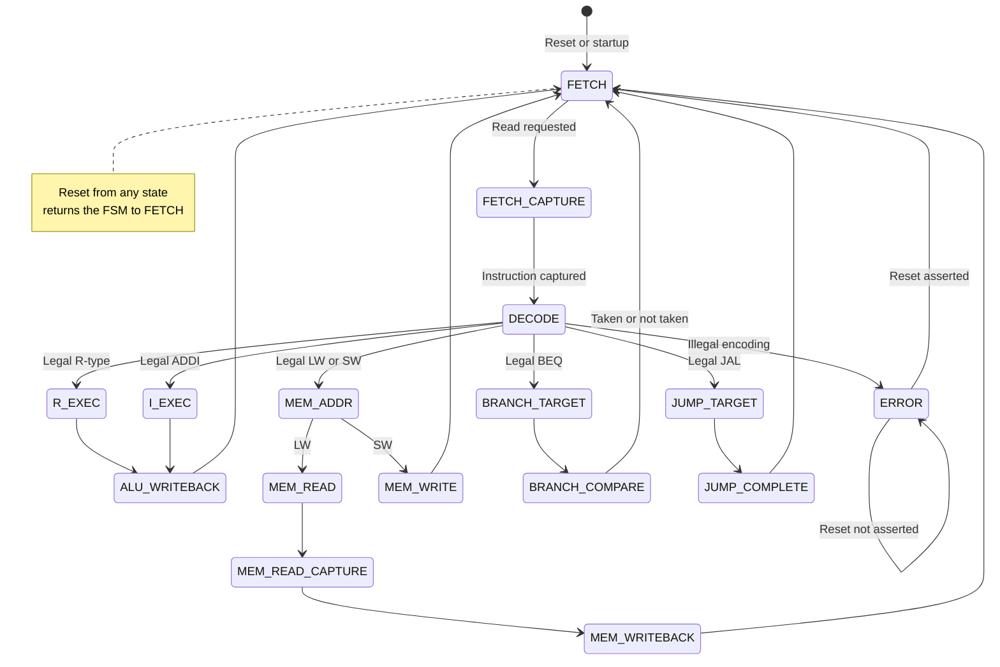

## Supported Instructions

OpenCoreX v0.1 implements the following 10 instruction subset of RV32I:

### Register-Register Arithmetic and Logic (R type)

- `ADD` — Add two register values
- `SUB` — Subtract one register value from another
- `AND` — Perform a bitwise AND
- `OR` — Perform a bitwise OR
- `XOR` — Perform a bitwise XOR

### Immediate Arithmetic 

- `ADDI` — Add a sign-extended immediate value to a register value

### Memory Access

- `LW` — Load a 32-bit word from memory into a register
- `SW` — Store a 32-bit register value into memory

### Control Flow

- `BEQ` — Branch when two register values are equal
- `JAL` — Jump to a PC-relative target and write the return address to a register

### Classification by RISC-V Encoding Format

| Format | Instructions | Primary behavior |
|---|---|---|
| R-type | `ADD`, `SUB`, `AND`, `OR`, `XOR` | Uses two register operands and writes an ALU result to `rd` |
| I-type | `ADDI`, `LW` | Uses one register operand and a sign-extended immediate |
| S-type | `SW` | Stores the value from `rs2` at an address calculated from `rs1` and an immediate |
| B-type | `BEQ` | Conditionally updates the PC using a PC-relative branch immediate |
| J-type | `JAL` | Unconditionally updates the PC and writes the return address to `rd` |

The behavioral classification describes what each instruction requires the processor to accomplish. The encoding-format classification will guide the design of the instruction decoder and immediate generator.

The subset was selected to exercise register-register ops, immediate ops, memory access, conditional branching, and unconditional jumping in a multicycle architecture.

## Memory Organization and Timing

OpenCoreX v0.1 uses a unified, single-port memory for both instructions and data. Because instruction fetches and data accesses occur during different clock cycles, they can reuse the same memory port.

Memory remains external to `opencorex_core`. This separates the processor from the physical memory implementation and allows simulation memory to be replaced with FPGA block RAM without redesigning the core datapath.

A memory-address multiplexer selects between:

- `PC` during instruction fetch
- `ALUOut` during `LW` and `SW` memory access

The memory interface uses synchronous, one-cycle-latency reads and synchronous writes.

### Memory Interface

The core presents the following memory signals:

| Signal | Direction relative to core | Width | Purpose |
|---|---|---:|---|
| `mem_addr` | Output | 32 | Byte address of the requested instruction or data word |
| `mem_read_data` | Input | 32 | Word returned by memory after a read request |
| `mem_write_data` | Output | 32 | Word written during an `SW` |
| `MemRead` | Output | 1 | Requests a synchronous memory read |
| `MemWrite` | Output | 1 | Requests a synchronous memory write |

`MemRead` and `MemWrite` must never be asserted simultaneously.

### Synchronous Reads

When `MemRead` is asserted, memory samples `mem_addr` on the active clock edge. The corresponding word appears on `mem_read_data` during the following clock cycle and remains stable until another read completes.

A read therefore requires two processor states:

1. A request state that presents the address and asserts `MemRead`.
2. A capture state that stores the returned value in `IR` or `MDR`.

#### Instruction Fetch

During `FETCH`:

- `mem_addr = PC`
- `MemRead = 1`
- The memory samples the current `PC`.
- The ALU calculates `PC + 4`.
- `OldPC` captures the current `PC`.
- `PCPlus4` and `PC` capture `PC + 4`.

During the following `FETCH_CAPTURE` state:

- `mem_read_data` contains the requested instruction.
- `IRWrite = 1`.
- `IR` captures `mem_read_data`.

The memory and processor registers sample their input values from before the active edge. Therefore, the memory receives the original `PC` even though the `PC` is updated on the same edge that accepts the read request.

#### Load Data Read

During `MEM_READ`:

- `mem_addr = ALUOut`
- `MemRead = 1`
- The memory samples the effective address.

During the following `MEM_READ_CAPTURE` state:

- `mem_read_data` contains the requested data word.
- `MDRWrite = 1`.
- `MDR` captures `mem_read_data`.

The loaded word is written to the register file during the later `MEM_WRITEBACK` state.

### Synchronous Writes

Memory is modified on the active clock edge when `MemWrite` is asserted:

`Memory[ALUOut] ← B`

For an `SW` instruction:

- `ALUOut` holds the effective byte address.
- `B` holds the value originally read from `rs2`.
- `mem_addr = ALUOut`
- `mem_write_data = B`
- `MemWrite` is asserted only during `MEM_WRITE`.

### Addressing and Alignment

OpenCoreX uses 32-bit byte addresses. Because v0.1 supports only 32-bit instructions and word-sized `LW` and `SW` accesses:

`mem_addr[1:0] = 2'b00`

must hold for every instruction fetch and data-memory access.

Misaligned instruction targets and misaligned `LW` or `SW` addresses are outside the architectural scope of v0.1. Verification assertions should detect them. The processor does not yet implement RISC-V misalignment exceptions.

The physical memory capacity is an implementation parameter and does not change the core’s 32-bit address interface.

## Register File

OpenCoreX v0.1 uses a 32-entry, 32-bit register file with:

- Two asynchronous read ports
- One synchronous write port
- One write-enable signal, `RegWrite`

The two read addresses come from the current instruction:

- `rs1` selects the first source register.
- `rs2` selects the second source register.

The register-file outputs change combinationally when either read address changes. During the decode/register-fetch cycle, the clocked temporary registers capture these outputs:

`A ← RegisterFile[rs1]`

`B ← RegisterFile[rs2]`

The `A` and `B` registers preserve the source operands while the instruction proceeds through later execution cycles.

### Synchronous Writes

A destination register is modified only on an active clock edge when `RegWrite` is asserted:

`RegisterFile[rd] ← WriteData`

The write-back data may come from:

- `ALUOut` for arithmetic and immediate instructions
- `MDR` for `LW`
- The address of the instruction following `JAL`

A write-back multiplexer will select the appropriate source.

### Register x0

RISC-V register `x0` must always contain zero.

Reads from `x0` always return 32-bit zero. Writes to `x0` are explicitly ignored:

`if RegWrite = 1 and rd ≠ 0, write RegisterFile[rd]`

Checking only `RegWrite` is insufficient because instructions are permitted to specify `x0` as their destination. The destination-address check prevents the storage associated with `x0` from being modified.

## Internal Datapath Registers

OpenCoreX v0.1 uses several clocked registers to preserve values across the multiple cycles required to execute an instruction. These registers are internal processor state and are separate from the 32-entry RISC-V register file.

### Program Counter (`PC`)

The `PC` holds the address used to fetch the next instruction.

During instruction fetch, the shared ALU calculates:

`PC + 4`

On the active clock edge, the `PC` captures this value so that it normally points to the next sequential instruction.

For control-flow instructions, the `PC` can instead capture a branch or jump target. A write-enable signal controls when the `PC` may change.

### Original Program Counter (`OldPC`)

During instruction fetch, `OldPC` captures the address of the instruction being fetched:

`OldPC ← PC`

This value must be preserved because the `PC` is updated to `PC + 4` during the same fetch cycle. `BEQ` and `JAL` calculate their PC-relative targets using the original instruction address:

`TargetAddress = OldPC + Immediate`

### Sequential Address Register (`PCPlus4`)

During instruction fetch, `PCPlus4` captures the sequential address calculated by the ALU:

`PCPlus4 ← PC + 4`

This value is preserved for `JAL`, which writes the address of the instruction following the jump into `rd`:

`RegisterFile[rd] ← PCPlus4`

Although the `PC` initially receives the same value during fetch, `PCPlus4` retains the return address after the `PC` is replaced by the jump target.

### Instruction Register (`IR`)

The `IR` captures the instruction returned by memory during `FETCH_CAPTURE`:

`IR ← mem_read_data`

It changes only when `IRWrite` is asserted. The preceding `FETCH` state issues the synchronous memory-read request using the current `PC`. The `IR` preserves the instruction fields—including `opcode`, `rs1`, `rs2`, `rd`, `funct3`, and `funct7`—throughout the instruction’s execution.

### Operand Registers (`A` and `B`)

During the decode/register-fetch cycle, the register-file outputs are captured as:

`A ← RegisterFile[IR.rs1]`

`B ← RegisterFile[IR.rs2]`

`A` preserves the first source operand. `B` preserves the second source operand and also supplies the data written to memory by `SW`.

### ALU Result Register (`ALUOut`)

`ALUOut` captures ALU results that are required during a later cycle. Depending on the instruction, it may preserve:

- An arithmetic or logical result
- An effective address for `LW` or `SW`
- A branch or jump target

Examples include:

`ALUOut ← A operation B`

`ALUOut ← A + Immediate`

`ALUOut ← OldPC + Immediate`

### Memory Data Register (`MDR`)

### Memory Data Register (`MDR`)

During `MEM_READ`, the processor requests the word located at the effective address stored in `ALUOut`.

During the following `MEM_READ_CAPTURE` state, the `MDR` captures the returned word:

`MDR ← mem_read_data`

The register preserves the loaded value until the following write-back cycle:

`RegisterFile[rd] ← MDR`

### Register Summary

| Register | Preserved value | Primary use |
|---|---|---|
| `PC` | Next instruction address | Instruction fetch and control flow |
| `OldPC` | Address of the current instruction | `BEQ` and `JAL` target calculation |
| `PCPlus4` | Address following the current instruction | `JAL` link write-back |
| `IR` | Current encoded instruction | Decode and control throughout execution |
| `A` | Value read from `rs1` | ALU operand and address calculation |
| `B` | Value read from `rs2` | ALU operand and `SW` write data |
| `ALUOut` | Saved ALU result | Arithmetic write-back, memory address, or control-flow target |
| `MDR` | Data read from memory | `LW` write-back |

## Shared Arithmetic Logic Unit

OpenCoreX v0.1 uses one shared 32-bit arithmetic logic unit (`ALU`) for arithmetic, logical, address-generation, instruction-sequencing, and control-flow operations. Reusing one ALU reduces hardware duplication and is appropriate for a multicycle processor because these operations occur during different clock cycles.

### Supported Operations

The ALU supports five operations:

| `ALUControl` | Operation | Result |
|---|---|---|
| `000` | `ADD` | `ALUInputA + ALUInputB` |
| `001` | `SUB` | `ALUInputA - ALUInputB` |
| `010` | `AND` | `ALUInputA & ALUInputB` |
| `011` | `OR` | `ALUInputA \| ALUInputB` |
| `100` | `XOR` | `ALUInputA ^ ALUInputB` |
| `101`–`111` | Reserved | Safe default result |

Because five operations must be represented, `ALUControl` is a 3-bit signal.

Addition is reused for:

- `ADD` and `ADDI`
- Instruction sequencing with `PC + 4`
- `LW` and `SW` effective-address calculation
- `BEQ` branch-target calculation
- `JAL` jump-target calculation

Subtraction is reused for:

- The `SUB` instruction
- The `BEQ` equality comparison

### ALU Input Selection

The first ALU operand is selected by the 2-bit `ALUSrcA` multiplexer:

| Source | Purpose |
|---|---|
| `PC` | Calculate `PC + 4` during instruction fetch |
| `OldPC` | Calculate PC-relative `BEQ` and `JAL` targets |
| `A` | Perform register operations and effective-address calculations |
| Reserved | Safe default value |

The second ALU operand is selected by the 2-bit `ALUSrcB` multiplexer:

| Source | Purpose |
|---|---|
| `B` | R-type operations and `BEQ` comparison |
| Constant `4` | Advance the program counter during instruction fetch |
| Immediate | Execute `ADDI` and calculate memory or control-flow addresses |
| Reserved | Safe default value |

The immediate is not stored in a separate datapath register. The immediate generator extracts and sign-extends the appropriate immediate directly from the instruction stored in `IR`.

### Combinational ALU Result

`ALUResult` is the current combinational output of the ALU. It changes whenever the selected operands or ALU operation change.

During instruction fetch:

`ALUResult = PC + 4`

This result is used to update the `PC` and is also captured by `PCPlus4` for possible use by `JAL`.

During a `BEQ` comparison:

`ALUResult = A - B`

The comparison result is used immediately by the `Zero` signal and does not need to be stored in `ALUOut`.

### Zero Flag and Branch Comparison

The ALU produces a combinational `Zero` signal:

`Zero = (ALUResult == 32'b0)`

For `BEQ`, the ALU subtracts the two source operands:

`ALUResult = A - B`

The operands are equal exactly when their difference is zero:

`A == B` if and only if `A - B == 0`

Signedness does not affect equality because `BEQ` compares the two 32-bit patterns directly.

The final program-counter write enable is:

`PCEnable = PCWrite | (PCWriteCond & Zero)`

During the `BEQ` comparison state, `PCWriteCond` is asserted. If `Zero` is also asserted, the `PC` captures the branch target previously stored in `ALUOut`.

### ALU Result Register

`ALUOut` is a 32-bit clocked register that preserves ALU results needed during later cycles. It has a dedicated write-enable signal named `ALUOutWrite`.

When `ALUOutWrite = 1`:

`ALUOut ← ALUResult`

When `ALUOutWrite = 0`, `ALUOut` retains its previous value.

Depending on the instruction, `ALUOut` may preserve:

- An R-type arithmetic or logical result
- An `ADDI` result
- An effective address for `LW` or `SW`
- A branch target for `BEQ`
- A jump target for `JAL`

For example, `BEQ` uses the ALU over two cycles:

```text
Branch-target cycle:
    ALUResult    = OldPC + Immediate
    ALUOutWrite  = 1
    ALUOut       ← ALUResult

Comparison cycle:
    ALUResult    = A - B
    ALUOutWrite  = 0
    Zero         = (ALUResult == 0)

    if Zero:
        PC ← ALUOut
```
`ALUOutWrite` remains disabled during the comparison cycle so that `A - B` does not overwrite the saved branch target.

Similarly, during the `JAL` completion state, `ALUOutWrite` remains disabled while the saved jump target is used to update the `PC`.

### ALU Operation Categories

The FSM does not directly generate the final 3-bit `ALUControl` value. Instead, it produces a simpler 2-bit `ALUOp` category:

| `ALUOp` | Category | Purpose |
|---|---|---|
| `00` | `ADD` | Sequencing, addresses, targets, and `ADDI` |
| `01` | `SUB` | `BEQ` comparison |
| `10` | `FUNC` | Decode an R-type operation from the instruction fields |
| `11` | Reserved | Illegal or unsupported operation |

This separates control responsibilities:

- The FSM determines the general purpose of the current cycle.
- The ALU decoder determines the exact operation.
- The ALU performs the selected operation.

### R-Type ALU Decoding

When `ALUOp = FUNC`, the ALU decoder examines the complete `funct3` and `funct7` fields.

| `funct3` | `funct7` | Operation |
|---|---|---|
| `000` | `0000000` | `ADD` |
| `000` | `0100000` | `SUB` |
| `100` | `0000000` | `XOR` |
| `110` | `0000000` | `OR` |
| `111` | `0000000` | `AND` |

The FSM can directly request addition or subtraction through `ALUOp` without using the R-type function fields. For example:

- `ALUOp = ADD` is used for `PC + 4`, address calculations, targets, and `ADDI`.
- `ALUOp = SUB` is used for the `BEQ` comparison.
- `ALUOp = FUNC` is used for supported R-type instructions.

### Unsupported Encodings

When `ALUOp = FUNC`, the ALU decoder produces `ALUControl` from the complete `funct3` and `funct7` fields. Unsupported combinations produce a safe default `ALUControl` value.

The controller is the sole owner of architectural instruction legality. It validates the complete instruction encoding during `DECODE` and routes any unsupported instruction directly to `ERROR` before execution.

The ALU decoder may also produce an internal `ALUDecodeValid` signal for
simulation assertions and waveform debugging. This signal does not control the FSM or cause architectural state transitions.

During verification:

`R_EXEC` implies `ALUDecodeValid = 1`

## Reset and Error Behavior

OpenCoreX v0.1 uses an active-high asynchronous reset. Reset takes effect immediately without waiting for a clock edge.

### Reset State

When reset is asserted:

- The FSM enters the `FETCH` state.
- The `PC` receives `RESET_VECTOR`.
- `OldPC`, `PCPlus4`, `IR`, `A`, `B`, `ALUOut`, and `MDR` clear to zero.
- Register `x0` is guaranteed to read as zero.
- Register-file entries `x1` through `x31` are not reset.
- Instruction and data memory are not reset.

Clearing the internal datapath registers provides deterministic startup behavior and clearer simulation waveforms. The controller must still ensure that every register receives a valid value before that value is consumed.

### Reset Vector

The reset vector is:

`RESET_VECTOR = 32'h0000_0000`

The first instruction is placed at address `0x00000000`.

Some processor systems reserve low addresses for boot code, exception vectors, operating-system structures, or null-pointer fault detection. OpenCoreX v0.1 does not currently implement those facilities, so reserving the low address range would add complexity without providing a useful capability.

### Illegal Instructions

Unsupported opcodes and invalid `funct3` or `funct7` combinations cause the processor to enter a dedicated `ERROR` state.

The `ERROR` state is sticky and can only be exited through reset. While in this state:

- `error = 1`
- `RegWrite = 0`
- `MemWrite = 0`
- `PCWrite = 0`
- `PCWriteCond = 0`
- `IRWrite = 0`
- `ALUOutWrite = 0`
-  `MemRead = 0`

The FSM remains in `ERROR`, preventing an unsupported instruction from modifying architectural state.

### State-Transition Table

### State-Transition Table

OpenCoreX v0.1 uses 16 FSM states. Instruction legality is checked during `DECODE` before an instruction enters an execution state. Synchronous memory reads use separate request and capture states.

| Current State | Condition | Next State |
|---|---|---|
| `FETCH` | Unconditional | `FETCH_CAPTURE` |
| `FETCH_CAPTURE` | Unconditional | `DECODE` |
| `DECODE` | Supported R-type encoding | `R_EXEC` |
| `DECODE` | Legal `ADDI` encoding | `I_EXEC` |
| `DECODE` | Legal `LW` or `SW` encoding | `MEM_ADDR` |
| `DECODE` | Legal `BEQ` encoding | `BRANCH_TARGET` |
| `DECODE` | Legal `JAL` encoding | `JUMP_TARGET` |
| `DECODE` | Any unsupported encoding | `ERROR` |
| `R_EXEC` | Unconditional | `ALU_WRITEBACK` |
| `I_EXEC` | Unconditional | `ALU_WRITEBACK` |
| `ALU_WRITEBACK` | Unconditional | `FETCH` |
| `MEM_ADDR` | Opcode is `LW` | `MEM_READ` |
| `MEM_ADDR` | Opcode is `SW` | `MEM_WRITE` |
| `MEM_READ` | Unconditional | `MEM_READ_CAPTURE` |
| `MEM_READ_CAPTURE` | Unconditional | `MEM_WRITEBACK` |
| `MEM_WRITEBACK` | Unconditional | `FETCH` |
| `MEM_WRITE` | Unconditional | `FETCH` |
| `BRANCH_TARGET` | Unconditional | `BRANCH_COMPARE` |
| `BRANCH_COMPARE` | Branch taken or not taken | `FETCH` |
| `JUMP_TARGET` | Unconditional | `JUMP_COMPLETE` |
| `JUMP_COMPLETE` | Unconditional | `FETCH` |
| `ERROR` | Reset not asserted | `ERROR` |
| Any state | Reset asserted | `FETCH` |

### Decode-State Routing

During `DECODE`, the controller checks the complete encoding required for each supported instruction before selecting the next state.

| Instruction | Required Encoding | Next State |
|---|---|---|
| `ADD` | `opcode = 0110011`, `funct3 = 000`, `funct7 = 0000000` | `R_EXEC` |
| `SUB` | `opcode = 0110011`, `funct3 = 000`, `funct7 = 0100000` | `R_EXEC` |
| `XOR` | `opcode = 0110011`, `funct3 = 100`, `funct7 = 0000000` | `R_EXEC` |
| `OR` | `opcode = 0110011`, `funct3 = 110`, `funct7 = 0000000` | `R_EXEC` |
| `AND` | `opcode = 0110011`, `funct3 = 111`, `funct7 = 0000000` | `R_EXEC` |
| `ADDI` | `opcode = 0010011`, `funct3 = 000` | `I_EXEC` |
| `LW` | `opcode = 0000011`, `funct3 = 010` | `MEM_ADDR` |
| `SW` | `opcode = 0100011`, `funct3 = 010` | `MEM_ADDR` |
| `BEQ` | `opcode = 1100011`, `funct3 = 000` | `BRANCH_TARGET` |
| `JAL` | `opcode = 1101111` | `JUMP_TARGET` |
| Unsupported | Any other required-field combination | `ERROR` |

An illegal instruction transitions directly from `DECODE` to `ERROR`. It never enters an execution state. During that `DECODE` cycle, all processor write-enable signals remain disabled.

### Instruction State Sequences

| Instruction | State Sequence |
|---|---|
| `ADD`, `SUB`, `XOR`, `OR`, `AND` | `FETCH → FETCH_CAPTURE → DECODE → R_EXEC → ALU_WRITEBACK → FETCH` |
| `ADDI` | `FETCH → FETCH_CAPTURE → DECODE → I_EXEC → ALU_WRITEBACK → FETCH` |
| `LW` | `FETCH → FETCH_CAPTURE → DECODE → MEM_ADDR → MEM_READ → MEM_READ_CAPTURE → MEM_WRITEBACK → FETCH` |
| `SW` | `FETCH → FETCH_CAPTURE → DECODE → MEM_ADDR → MEM_WRITE → FETCH` |
| `BEQ` | `FETCH → FETCH_CAPTURE → DECODE → BRANCH_TARGET → BRANCH_COMPARE → FETCH` |
| `JAL` | `FETCH → FETCH_CAPTURE → DECODE → JUMP_TARGET → JUMP_COMPLETE → FETCH` |
| Illegal instruction | `FETCH → FETCH_CAPTURE → DECODE → ERROR` |

The `ERROR` state is sticky. Once entered, the processor remains in `ERROR` until reset. Reset returns the FSM to `FETCH` and restores the processor to its defined initial state.

### Control-Signal Table

All control outputs receive explicit values in every state. When a multiplexer output is unused, the controller assigns its defined safe-default encoding rather than an unknown or don't-care value.

`Legal` means the instruction in `IR` matches one of the exact supported opcode, `funct3`, and, where required, `funct7` combinations. Therefore, during `DECODE`:

- Legal instruction: `AWrite = 1` and `BWrite = 1`
- Illegal instruction: `AWrite = 0` and `BWrite = 0`

#### Multiplexer Encodings

| Control | `00` / `0` | `01` / `1` | `10` | `11` |
|---|---|---|---|---|
| `MemAddrSource` | `PC` | `ALUOut` | Reserved | Reserved |
| `ALUSrcA` | `PC` | `OldPC` | `A` | Reserved |
| `ALUSrcB` | `B` | Constant `4` | Immediate | Reserved |
| `PCSource` | `ALUResult` | `ALUOut` | Reserved | Reserved |
| `WriteBackSelect` | `ALUOut` | `MDR` | `PCPlus4` | Reserved |

`MemAddrSource` is a one-bit control. The other selector encodings are shown using their defined two-bit values.

#### ALU Operation Encodings

| `ALUOp` | Operation category |
|---|---|
| `00` | `ADD` |
| `01` | `SUB` |
| `10` | `FUNC` |
| `11` | Reserved |

#### Safe Default Selector Values

Unless a state requires another value, the controller uses:

- `MemAddrSource = 0`
- `ALUSrcA = 00`
- `ALUSrcB = 00`
- `ALUOp = 00`
- `PCSource = 00`
- `WriteBackSelect = 00`

#### Encoded State Outputs

| State | `PCWrite` | `PCWriteCond` | `IRWrite` | `OldPCWrite` | `PCPlus4Write` | `AWrite` | `BWrite` | `ALUOutWrite` | `MDRWrite` | `RegWrite` | `MemRead` | `MemWrite` | `error` | `MemAddrSource` | `ALUSrcA` | `ALUSrcB` | `ALUOp` | `PCSource` | `WriteBackSelect` |
|---|---:|---:|---:|---:|---:|---:|---:|---:|---:|---:|---:|---:|---:|---:|---:|---:|---:|---:|---:|
| `FETCH` | `1` | `0` | `0` | `1` | `1` | `0` | `0` | `0` | `0` | `0` | `1` | `0` | `0` | `0` | `00` | `01` | `00` | `0` | `00` |
| `FETCH_CAPTURE` | `0` | `0` | `1` | `0` | `0` | `0` | `0` | `0` | `0` | `0` | `0` | `0` | `0` | `0` | `00` | `00` | `00` | `0` | `00` |
| `DECODE` | `0` | `0` | `0` | `0` | `0` | `Legal` | `Legal` | `0` | `0` | `0` | `0` | `0` | `0` | `0` | `00` | `00` | `00` | `0` | `00` |
| `R_EXEC` | `0` | `0` | `0` | `0` | `0` | `0` | `0` | `1` | `0` | `0` | `0` | `0` | `0` | `0` | `10` | `00` | `10` | `0` | `00` |
| `I_EXEC` | `0` | `0` | `0` | `0` | `0` | `0` | `0` | `1` | `0` | `0` | `0` | `0` | `0` | `0` | `10` | `10` | `00` | `0` | `00` |
| `ALU_WRITEBACK` | `0` | `0` | `0` | `0` | `0` | `0` | `0` | `0` | `0` | `1` | `0` | `0` | `0` | `0` | `00` | `00` | `00` | `0` | `00` |
| `MEM_ADDR` | `0` | `0` | `0` | `0` | `0` | `0` | `0` | `1` | `0` | `0` | `0` | `0` | `0` | `0` | `10` | `10` | `00` | `0` | `00` |
| `MEM_READ` | `0` | `0` | `0` | `0` | `0` | `0` | `0` | `0` | `0` | `0` | `1` | `0` | `0` | `1` | `00` | `00` | `00` | `0` | `00` |
| `MEM_READ_CAPTURE` | `0` | `0` | `0` | `0` | `0` | `0` | `0` | `0` | `1` | `0` | `0` | `0` | `0` | `0` | `00` | `00` | `00` | `0` | `00` |
| `MEM_WRITEBACK` | `0` | `0` | `0` | `0` | `0` | `0` | `0` | `0` | `0` | `1` | `0` | `0` | `0` | `0` | `00` | `00` | `00` | `0` | `01` |
| `MEM_WRITE` | `0` | `0` | `0` | `0` | `0` | `0` | `0` | `0` | `0` | `0` | `0` | `1` | `0` | `1` | `00` | `00` | `00` | `0` | `00` |
| `BRANCH_TARGET` | `0` | `0` | `0` | `0` | `0` | `0` | `0` | `1` | `0` | `0` | `0` | `0` | `0` | `0` | `01` | `10` | `00` | `0` | `00` |
| `BRANCH_COMPARE` | `0` | `1` | `0` | `0` | `0` | `0` | `0` | `0` | `0` | `0` | `0` | `0` | `0` | `0` | `10` | `00` | `01` | `1` | `00` |
| `JUMP_TARGET` | `0` | `0` | `0` | `0` | `0` | `0` | `0` | `1` | `0` | `0` | `0` | `0` | `0` | `0` | `01` | `10` | `00` | `0` | `00` |
| `JUMP_COMPLETE` | `1` | `0` | `0` | `0` | `0` | `0` | `0` | `0` | `0` | `1` | `0` | `0` | `0` | `0` | `00` | `00` | `00` | `1` | `10` |
| `ERROR` | `0` | `0` | `0` | `0` | `0` | `0` | `0` | `0` | `0` | `0` | `0` | `0` | `1` | `0` | `00` | `00` | `00` | `0` | `00` |
The final program-counter enable is:

`PCEnable = PCWrite | (PCWriteCond & Zero)`

Therefore:

- `FETCH` unconditionally updates the `PC` from `ALUResult`.
- `BRANCH_COMPARE` updates the `PC` from `ALUOut` only when `Zero = 1`.
- `JUMP_COMPLETE` unconditionally updates the `PC` from `ALUOut`.

### FSM State-Transition Diagram
### FSM State-Transition Diagram



### Datapath Multiplexer Encodings

The controller uses the following fixed encodings for the datapath multiplexer select signals. Reserved selections must still produce a defined output to prevent unknown values from propagating through the datapath.

| Control | Width | Defined encodings |
|---|---:|---|
| `MemAddrSource` | 1 | `0`: `PC`; `1`: `ALUOut` |
| `ALUSrcA` | 2 | `00`: `PC`; `01`: `OldPC`; `10`: `A`; `11`: Reserved |
| `ALUSrcB` | 2 | `00`: `B`; `01`: Constant `4`; `10`: Immediate; `11`: Reserved |
| `PCSource` | 1 | `0`: `ALUResult`; `1`: `ALUOut` |
| `WriteBackSelect` | 2 | `00`: `ALUOut`; `01`: `MDR`; `10`: `PCPlus4`; `11`: Reserved |

#### `MemAddrSource`

`MemAddrSource` selects the address presented to Unified Memory.

| `MemAddrSource` | Selected source |
|---|---|
| `1'b0` | `PC` |
| `1'b1` | `ALUOut` |

`PC` supplies the instruction address during `FETCH`. `ALUOut` supplies the effective data-memory address during `MEM_READ` and `MEM_WRITE`.

## RTL Module Interfaces

### Module Hierarchy

```text
system_top or FPGA wrapper
├── opencorex_core
│   ├── controller
│   └── datapath
│       ├── alu
│       ├── alu_decoder
│       ├── immediate_generator
│       └── register_file
└── memory
```

`opencorex_core` contains the processor state and control logic. Memory remains outside the core so that simulation memory can later be replaced with FPGA block RAM or another memory subsystem without redesigning the CPU.

### `opencorex_core`

| Port | Direction | Width | Purpose |
|---|---|---:|---|
| `clk` | Input | 1 | Processor clock |
| `reset` | Input | 1 | Active-high asynchronous processor reset |
| `mem_read_data` | Input | 32 | Word returned by synchronous memory |
| `mem_addr` | Output | 32 | Instruction or data byte address |
| `mem_write_data` | Output | 32 | Data supplied during a store |
| `mem_read` | Output | 1 | Synchronous memory-read request |
| `mem_write` | Output | 1 | Synchronous memory-write request |
| `error` | Output | 1 | Indicates that the controller is in `ERROR` |

The core owns processor state but does not own the memory array. It exposes only the processor-side memory interface.

### `controller`

The controller owns:

- The current FSM state
- Next-state selection
- Complete instruction-legality checking
- Control-signal generation
- Entry into and retention of the sticky `ERROR` state

#### Inputs

| Signal | Width | Source |
|---|---:|---|
| `clk` | 1 | Core clock |
| `reset` | 1 | Core reset |
| `opcode` | 7 | `IR[6:0]` from the datapath |
| `funct3` | 3 | `IR[14:12]` from the datapath |
| `funct7` | 7 | `IR[31:25]` from the datapath |

The complete `funct7` field crosses the boundary so the controller can distinguish exact supported encodings from illegal encodings.

#### Outputs

| Signal | Width | Purpose |
|---|---:|---|
| `PCWrite` | 1 | Requests an unconditional `PC` update |
| `PCWriteCond` | 1 | Requests a `PC` update when the ALU result is zero |
| `IRWrite` | 1 | Enables `IR` capture |
| `OldPCWrite` | 1 | Enables `OldPC` capture |
| `PCPlus4Write` | 1 | Enables `PCPlus4` capture |
| `AWrite` | 1 | Enables operand register `A` |
| `BWrite` | 1 | Enables operand register `B` |
| `ALUOutWrite` | 1 | Enables `ALUOut` capture |
| `MDRWrite` | 1 | Enables `MDR` capture |
| `RegWrite` | 1 | Enables register-file write-back |
| `MemRead` | 1 | Requests a synchronous memory read |
| `MemWrite` | 1 | Requests a synchronous memory write |
| `MemAddrSource` | 1 | Selects `PC` or `ALUOut` as the memory address |
| `ALUSrcA` | 2 | Selects the first ALU operand |
| `ALUSrcB` | 2 | Selects the second ALU operand |
| `ALUOp` | 2 | Selects the ALU operation category |
| `PCSource` | 1 | Selects the value written to the `PC` |
| `WriteBackSelect` | 2 | Selects register-file write-back data |
| `error` | 1 | Indicates that the current state is `ERROR` |

The FSM state is sequential. The controller outputs are combinational functions of the current state and decoded instruction fields.

Reset asynchronously returns the FSM to `FETCH`.

### `datapath`

The datapath owns:

- `PC`
- `OldPC`
- `PCPlus4`
- `IR`
- `A`
- `B`
- `ALUOut`
- `MDR`
- The register file
- The ALU and ALU decoder
- The immediate generator
- All datapath multiplexers
- Instruction-field extraction

#### Inputs

| Signal group | Signals |
|---|---|
| Clock and reset | `clk`, `reset` |
| Register enables | `PCWrite`, `PCWriteCond`, `IRWrite`, `OldPCWrite`, `PCPlus4Write`, `AWrite`, `BWrite`, `ALUOutWrite`, `MDRWrite` |
| Architectural write control | `RegWrite` |
| Datapath selectors | `MemAddrSource`, `ALUSrcA[1:0]`, `ALUSrcB[1:0]`, `PCSource`, `WriteBackSelect[1:0]` |
| ALU control category | `ALUOp[1:0]` |
| Memory response | `mem_read_data[31:0]` |

#### Outputs

| Signal | Width | Destination |
|---|---:|---|
| `opcode` | 7 | Controller |
| `funct3` | 3 | Controller |
| `funct7` | 7 | Controller |
| `mem_addr` | 32 | External memory |
| `mem_write_data` | 32 | External memory |

The datapath extracts the instruction fields directly from `IR`.

The ALU produces the internal combinational signal:

`Zero = (ALUResult == 32'b0)`

The datapath computes the final program-counter enable:

`PCEnable = PCWrite | (PCWriteCond & Zero)`

Because this expression is evaluated inside the datapath, `Zero` does not need to cross into the controller.

### `alu`

| Port | Direction | Width |
|---|---|---:|
| `operand_a` | Input | 32 |
| `operand_b` | Input | 32 |
| `ALUControl` | Input | 3 |
| `result` | Output | 32 |
| `Zero` | Output | 1 |

The ALU is purely combinational and contains no resettable state.

`Zero` is asserted whenever the 32-bit ALU result equals zero.

### `alu_decoder`

| Port | Direction | Width |
|---|---|---:|
| `ALUOp` | Input | 2 |
| `funct3` | Input | 3 |
| `funct7` | Input | 7 |
| `ALUControl` | Output | 3 |
| `ALUDecodeValid` | Output | 1 |

The ALU decoder is combinational.

When `ALUOp = FUNC`, the complete `funct3` and `funct7` fields determine the R-type operation. Unsupported combinations produce a safe default `ALUControl` value and deassert `ALUDecodeValid`.

`ALUDecodeValid` is used only for assertions and waveform debugging. It does not control the FSM or determine architectural instruction legality.

A required integration-level verification property is:

`R_EXEC` implies `ALUDecodeValid = 1`

### `immediate_generator`

| Port | Direction | Width |
|---|---|---:|
| `instruction` | Input | 32 |
| `immediate` | Output | 32 |

The immediate generator is combinational. It examines the instruction opcode, selects the required I-, S-, B-, or J-type immediate format, and sign-extends the result to 32 bits.

The generated immediate remains an internal datapath signal.

### `register_file`

| Port | Direction | Width |
|---|---|---:|
| `clk` | Input | 1 |
| `read_addr_1` | Input | 5 |
| `read_addr_2` | Input | 5 |
| `write_addr` | Input | 5 |
| `write_data` | Input | 32 |
| `write_enable` | Input | 1 |
| `read_data_1` | Output | 32 |
| `read_data_2` | Output | 32 |

The register file has two asynchronous read ports and one synchronous write port.

Writes occur on the active clock edge when:

`write_enable = 1 and write_addr != 5'b00000`

Writes to `x0` are ignored, and reads from `x0` always return zero. Registers `x1` through `x31` are not reset.

### `memory`

| Port | Direction | Width |
|---|---|---:|
| `clk` | Input | 1 |
| `read_enable` | Input | 1 |
| `write_enable` | Input | 1 |
| `address` | Input | 32 |
| `write_data` | Input | 32 |
| `read_data` | Output | 32 |

Memory has one synchronous read/write port.

A read request accepted on an active clock edge updates `read_data` for the following processor cycle. A write request modifies memory on the active clock edge.

Memory contents are not reset.

The controller guarantees:

`!(MemRead && MemWrite)`

The processor uses byte addresses, but v0.1 supports only aligned 32-bit accesses. Therefore:

`address[1:0] = 2'b00`

must hold for every instruction fetch, `LW`, and `SW`.

### Sequential-State Ownership

| State element | Sole RTL owner |
|---|---|
| Current FSM state | `controller` |
| `PC` | `datapath` |
| `OldPC` | `datapath` |
| `PCPlus4` | `datapath` |
| `IR` | `datapath` |
| `A` | `datapath` |
| `B` | `datapath` |
| `ALUOut` | `datapath` |
| `MDR` | `datapath` |
| Register-file state | `register_file` |
| Memory contents | `memory` |
| Registered memory-read output | `memory` |

Every clocked state element has exactly one RTL owner and must be assigned by only one sequential process.

### Future Accelerator Extension

Future accelerator instructions can be identified using `opcode`, `funct3`, and `funct7` without exposing the complete `IR` to the controller.

A future accelerator interface may add signals such as:

- `AccelStart`
- `AccelOp`
- `AccelBusy`
- `AccelDone`
- Accelerator operand inputs
- Accelerator result output

If an accelerator requires direct memory access, memory arbitration will be added outside `opencorex_core`. This prevents the CPU and accelerator from directly driving the same memory interface and preserves the existing processor internals.