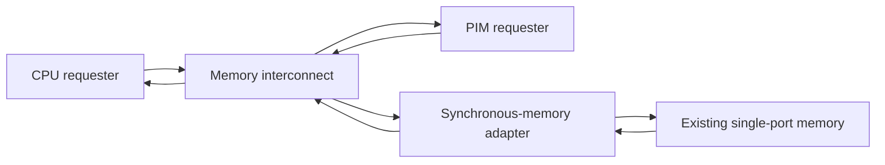
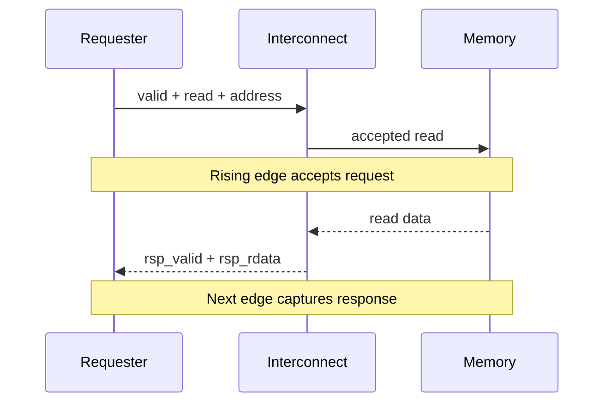

# OpenCoreX Memory Request/Ready Interface v0.1

## Purpose

This document defines the first stallable shared-memory interface for OpenCoreX.

The interface allows two independent requesters at the CPU and a future PIM
engine to share the existing unified, single-port synchronous memory. It
provides:

- request backpressure,
- one accepted memory request per cycle,
- deterministic arbitration,
- read-response ownership,
- safe CPU or PIM stalling,
- measurable contention behavior,
- a path toward nonblocking CPU/PIM execution.

This interface borrows the `valid`/`ready` handshake principle used by AXI, but
it is not an AXI implementation. It does not currently support separate AXI
channels, bursts, transaction IDs, byte strobes, out-of-order completion, or
multiple memory ports.

The initial design prioritizes explicit behavior and verification over maximum
protocol complexity.

## System Topology



The system contains three new logical boundaries:

1. The CPU and PIM expose identical request/response interfaces.
2. The memory interconnect selects at most one request per cycle.
3. The synchronous-memory adapter converts an accepted request into the
   existing `read_enable`, `write_enable`, `address`, and `write_data` signals.

The existing memory remains the physical storage implementation.

## Terminology

A **requester** is a component that initiates a memory operation. In v0.1, the
requesters are the CPU and PIM engine.

A **request** contains the operation type, address, and optional write data.

A **handshake** occurs on a rising clock edge when both `mem_req_valid` and
`mem_req_ready` are asserted.

A **response** returns data from a previously accepted read request.

A **conflict** occurs when the CPU and PIM both present valid requests during
the same cycle.

A **stalled request** is a valid request for which `mem_req_ready` is low.

## Signal Definitions

Each requester uses the following signals.

| Signal | Direction relative to requester | Width | Meaning |
|---|---|---:|---|
| `mem_req_valid` | Output | 1 | Request fields are valid |
| `mem_req_ready` | Input | 1 | Interconnect can accept the request |
| `mem_req_write` | Output | 1 | `1` for write, `0` for read |
| `mem_req_addr` | Output | 32 | Byte address |
| `mem_req_wdata` | Output | 32 | Write data; ignored for reads |
| `mem_rsp_valid` | Input | 1 | Read-response data is valid |
| `mem_rsp_rdata` | Input | 32 | Returned read data |

The request payload is:

```text
{mem_req_write, mem_req_addr, mem_req_wdata}
```

A request is accepted only when:

```systemverilog
mem_req_fire = mem_req_valid && mem_req_ready;
```

The interface supports one 32-bit word per request.

## Request Handshake

The requester asserts `mem_req_valid` whenever it has a complete request
available.

The interconnect asserts `mem_req_ready` when that requester has been selected
and the downstream memory path can accept the request.

The request takes effect only on a rising clock edge for which both signals are
high.

| `mem_req_valid` | `mem_req_ready` | Meaning |
|---:|---:|---|
| 0 | 0 | No request and no acceptance |
| 0 | 1 | Interconnect is available, but no request is presented |
| 1 | 0 | Request is stalled and must be held |
| 1 | 1 | Request is accepted on the rising edge |

The requester must not interpret `mem_req_ready` by itself as completion.
Completion requires `mem_req_valid && mem_req_ready`.

The requester must not wait for `mem_req_ready` before asserting
`mem_req_valid`. Doing so could deadlock if the destination also waits to see
`mem_req_valid` before asserting `mem_req_ready`.

## Requester Requirements

A requester owns its request until the handshake occurs.

While:

```systemverilog
mem_req_valid && !mem_req_ready
```

the requester must:

- keep `mem_req_valid` asserted;
- keep `mem_req_write` stable;
- keep `mem_req_addr` stable;
- keep `mem_req_wdata` stable;
- remain in the request state;
- avoid advancing pointers or counters associated with the request;
- avoid treating the read or write as completed.

After a request handshake, the requester may deassert `mem_req_valid` or
present a new request during the following cycle.

For a write, the request handshake completes the memory operation from the
requester’s perspective.

For a read, the request handshake completes only the request phase. The
requester must then wait for `mem_rsp_valid`.

## Read-Response Timing

The existing OpenCoreX memory performs synchronous reads.

When a read request is accepted on a rising edge:

1. The memory samples the accepted address on that edge.
2. The memory updates `read_data` from the selected word.
3. The adapter asserts the response during the following cycle.
4. The selected requester captures the response on the next rising edge.

Conceptually:



Example timing:

| Cycle | Request signals | Event |
|---|---|---|
| C0 | `req_valid=1`, `req_ready=1`, read address valid | Read accepted at end of C0 |
| C1 | `rsp_valid=1`, `rsp_rdata` valid | Requester captures data at end of C1 |
| C2 | `rsp_valid=0` unless another read was accepted | Previous response complete |

The response interface does not include `mem_rsp_ready` in v0.1. A requester
that launches a read is required to remain able to capture its response.

The response is a one-cycle event. It is not held indefinitely.

## Supported Concurrency

The shared memory accepts at most one request per cycle.

The interface may accept a new request during the same cycle in which the
previous read response is being presented. Therefore, the fixed one-cycle
memory can sustain one accepted request per cycle when requesters and memory
remain ready.

The v0.1 interface has:

- no transaction IDs;
- no out-of-order completion;
- no speculative response routing;
- no response queue;
- at most one response generated per cycle.

Read responses are returned in accepted-request order.

## Arbitration Policy

The interconnect uses two-requester round-robin arbitration.

The arbitration policy is:

1. If neither requester is valid, grant neither requester.
2. If only the CPU is valid, select the CPU.
3. If only the PIM engine is valid, select the PIM engine.
4. If both are valid, select the requester that did not receive the most recent
   accepted grant.
5. Update round-robin history only when a request is accepted.

Reset initializes the history so that the CPU wins the first conflict after
reset.

When both requesters remain continuously valid and memory remains ready, the
expected accepted sequence is:

```text
CPU, PIM, CPU, PIM, ...
```

Round-robin arbitration prevents permanent starvation but does not guarantee a
fixed maximum latency if the downstream memory remains unavailable
indefinitely.

## Grant Locking During a Stall

If the interconnect selects a requester but downstream memory is not ready, the
selection must remain locked until the request is accepted or reset is
asserted.

Example:

| Cycle | CPU valid | PIM valid | Memory ready | Selected | Accepted |
|---|---:|---:|---:|---|---:|
| C0 | 1 | 1 | 0 | CPU | 0 |
| C1 | 1 | 1 | 0 | CPU | 0 |
| C2 | 1 | 1 | 1 | CPU | 1 |
| C3 | 1 | 1 | 1 | PIM | 1 |

The interconnect must not switch from CPU to PIM during C1 merely because both
remain valid. Switching the selected requester while stalled could change the
address or write data presented downstream before the original request is
accepted.

A locked grant is released when:

- the selected request handshakes, or
- reset is asserted.

## Request Routing

The selected requester drives the downstream request fields:

```text
downstream request valid = selected requester valid
downstream request write = selected requester write
downstream request address = selected requester address
downstream request write data = selected requester write data
```

Only the selected requester receives downstream `ready`.

The unselected requester receives:

```text
mem_req_ready = 0
```

The interconnect must never assert both CPU and PIM request-ready outputs for
the same single-port memory transaction.

## Response Ownership

The interconnect must remember which requester owned each accepted read.

On an accepted read:

```systemverilog
accepted_read =
    downstream_req_valid &&
    downstream_req_ready &&
    !downstream_req_write;
```

The interconnect records:

- that a read response is pending;
- whether the CPU or PIM issued the read.

During the response cycle:

- `cpu_mem_rsp_valid` is asserted only for a CPU-owned response;
- `pim_mem_rsp_valid` is asserted only for a PIM-owned response;
- the corresponding requester receives `mem_rsp_rdata`;
- the other requester receives `mem_rsp_valid = 0`.

A write must not create a read response.

The ownership state belongs to the accepted read, not to whichever requester is
currently being granted. Arbitration for a new request may occur while a
previous read response is being delivered.

## Synchronous-Memory Adapter

The adapter translates the downstream handshake into the existing memory
controls.

A read pulse is generated only when a read request is accepted:

```systemverilog
memory_read_enable =
    downstream_req_valid &&
    downstream_req_ready &&
    !downstream_req_write;
```

A write pulse is generated only when a write request is accepted:

```systemverilog
memory_write_enable =
    downstream_req_valid &&
    downstream_req_ready &&
    downstream_req_write;
```

The adapter forwards:

```text
memory.address    = downstream_req_addr
memory.write_data = downstream_req_wdata
```

With the current memory implementation, the adapter is ready to accept one
request per cycle whenever reset is inactive.

The adapter must ensure that `memory_read_enable` and `memory_write_enable` are
never asserted simultaneously.

## CPU Behavior Under Backpressure

The current controller advances unconditionally from `FETCH` to
`FETCH_CAPTURE`, from `MEM_READ` to `MEM_READ_CAPTURE`, and from `MEM_WRITE` to
`FETCH`. That behavior must change when request/ready is integrated.

### Instruction fetch

During `FETCH`, the CPU presents the PC as a read request.

If the request is not accepted:

- remain in `FETCH`;
- hold `PC`;
- hold `OldPC`;
- hold `PCPlus4`;
- keep the request address and operation stable.

When the request is accepted:

- update `OldPC`;
- calculate and store `PC + 4`;
- update `PC`;
- transition to `FETCH_CAPTURE`.

During `FETCH_CAPTURE`, the CPU waits until `mem_rsp_valid` is asserted.

If no response is available:

- remain in `FETCH_CAPTURE`;
- do not write `IR`.

When the response arrives:

- assert `IRWrite`;
- capture `mem_rsp_rdata`;
- transition to `DECODE`.

### Load

During `MEM_READ`, the CPU presents `ALUOut` as a read request.

If the request is not accepted:

- remain in `MEM_READ`;
- preserve `ALUOut`;
- keep the request stable.

When accepted, transition to `MEM_READ_CAPTURE`.

During `MEM_READ_CAPTURE`, remain in that state until `mem_rsp_valid` is
asserted. Assert `MDRWrite` only when the response is valid.

### Store

During `MEM_WRITE`, the CPU presents `ALUOut` and `B` as a write request.

If the request is not accepted:

- remain in `MEM_WRITE`;
- preserve the address and write data;
- produce no memory side effect.

When accepted:

- perform exactly one write;
- transition to `FETCH`.

This prevents a stalled store from being written repeatedly.

## PIM Behavior Under Backpressure

The PIM engine must follow the same request rules as the CPU.

For each operand, descriptor, or result access, it must:

1. present a complete request;
2. hold the request stable while stalled;
3. advance its address or element counter only after a handshake;
4. wait for `mem_rsp_valid` after each accepted read;
5. associate returned data with the operation that requested it;
6. produce each result write exactly once.

The first PIM engine will support one logical accelerator operation at a time.
Command queues and multiple outstanding accelerator operations are deferred.

## Memory Ownership Model

CPU and PIM do not own fixed address regions at the electrical interface.
Either requester may issue an address within the implemented memory range.

Software and the accelerator command contract determine the logical roles of
memory regions, including:

- input vector storage;
- matrix or weight storage;
- descriptor storage;
- output storage;
- program storage;
- completion or status storage.

The arbiter controls port ownership for each accepted transaction. It does not
provide cache coherence, memory protection, or automatic hazard detection.

Software must not allow the CPU to consume a PIM result before completion has
been observed.

Concurrent writes to the same address and CPU reads of PIM-owned output data
while PIM is still producing results are programming errors in v0.1.

## Ordering

Each requester observes its accepted operations in issue order.

The single-port memory establishes a global accepted-request order because only
one request can be accepted per cycle.

The interface does not reorder requests.

A completed PIM operation must not assert `done` until all required result
writes have been accepted. This ensures that observing `done` implies that the
result data has reached shared memory.

## Reset Behavior

Reset is active high and uses the system reset signal.

While reset is asserted:

- CPU and PIM request-ready outputs are deasserted;
- downstream read and write enables are deasserted;
- response-valid outputs are deasserted;
- pending-response state is cleared;
- response ownership is cleared;
- any locked grant is cleared;
- round-robin state returns to deterministic CPU-first priority;
- no request is accepted;
- no memory write occurs.

Any request or response interrupted by reset is discarded. Requesters must
restart from their reset states.

The underlying memory array is not cleared by reset. This preserves the current
OpenCoreX behavior and allows preloaded programs and test data to remain
available after processor reset.

The PIM engine must return to idle with:

```text
busy = 0
done = 0
error = 0
```

unless a later architecture defines sticky status behavior.

## Error Conditions

The existing memory detects the following simulation-time errors:

- read and write asserted simultaneously;
- address not aligned to a four-byte word;
- address outside the implemented memory range.

The interconnect and adapter must not weaken these checks.

Additional protocol assertions should detect:

- request payload changing while valid and stalled;
- both requester-ready outputs asserted for one transaction;
- read response generated without an accepted read;
- response routed to the wrong requester;
- both response-valid outputs asserted simultaneously;
- write request generating a read response;
- request counted without a handshake;
- store side effect occurring more than once;
- grant changing while locked and stalled.

Hardware exception responses are not included in v0.1. Simulation violations
may terminate the test with `$fatal`.

## Performance Counters

The first implementation should expose or allow the testbench to count:

- accepted CPU read requests;
- accepted CPU write requests;
- accepted PIM read requests;
- accepted PIM write requests;
- CPU request-wait cycles;
- PIM request-wait cycles;
- CPU/PIM conflict cycles;
- CPU grants;
- PIM grants;
- CPU read responses;
- PIM read responses;
- total active cycles.

A request-wait cycle is:

```systemverilog
mem_req_valid && !mem_req_ready
```

for the corresponding requester.

A conflict cycle is:

```systemverilog
cpu_mem_req_valid && pim_mem_req_valid
```

An accepted transaction is counted only on:

```systemverilog
mem_req_valid && mem_req_ready
```

Holding a request valid for multiple stalled cycles must increase the wait-cycle
counter but must not increase the accepted-request counter.

The first counters may remain testbench instrumentation. They do not need to
become software-visible PMU registers immediately.

## Verification Requirements

The interconnect and adapter must be verified independently before CPU
integration.

Required directed tests include:

1. CPU-only read.
2. CPU-only write.
3. PIM-only read.
4. PIM-only write.
5. CPU and PIM requesting simultaneously.
6. Alternating grants under continuous contention.
7. CPU request stalled for multiple cycles.
8. PIM request stalled for multiple cycles.
9. Grant remains locked during a downstream stall.
10. Request payload remains stable while stalled.
11. A stalled write produces no early or repeated write.
12. CPU read response returns only to the CPU.
13. PIM read response returns only to PIM.
14. Back-to-back reads route to the correct owners.
15. A write following a read does not corrupt the pending read response.
16. Reset while a request is stalled.
17. Reset while a read response is pending.
18. Misaligned address failure.
19. Out-of-range address failure.
20. No starvation under continuous two-requester contention.

After CPU integration, every existing regression must still pass.

With PIM inactive and downstream memory immediately ready, the matrix-vector
benchmark must preserve:

- 32 correct outputs;
- 23,685 active cycles;
- 4,327 dynamic instruction fetches;
- existing instruction and data traffic counts.

A changed count under those conditions indicates an unintended interface bubble
or a changed measurement boundary and must be explained before acceptance.

## Deferred Features

The following features are explicitly outside v0.1:

- full AMBA AXI compliance;
- burst transfers;
- byte-write strobes;
- subword loads and stores;
- transaction IDs;
- out-of-order responses;
- response backpressure;
- multiple memory ports;
- multiple outstanding variable-latency reads;
- command queues;
- multiple outstanding PIM operations;
- cache coherence;
- virtual memory;
- memory protection;
- atomic operations;
- quality-of-service classes;
- programmable arbitration priority;
- hardware error-response channels;
- DMA.

These features may be added later if required by the PIM model, FPGA platform,
or research question.

## Design Decisions Still Open

The following questions remain open for discussion with Professor Yang:

1. Whether round-robin arbitration is sufficient for the first research model.
2. Whether PIM should eventually receive bandwidth or deadline guarantees.
3. Whether instruction fetches and CPU data accesses should remain one requester
   or become separately arbitrated ports.
4. Whether PIM should use shared memory exclusively or gain a local scratchpad.
5. Whether PiMulator timing can be represented through downstream backpressure
   and delayed responses.
6. Whether future variable-latency memory requires response backpressure.
7. Whether descriptor traffic should share the same port as PIM operand traffic.
8. Which interconnect counters should become software-visible PMU registers.

## References

- [OpenCoreX architecture](architecture-v0.1.md)
- [OpenCoreX evaluation methodology](evaluation-methodology.md)
- [`rtl/memory.sv`](../rtl/memory.sv)
- [Arm, Introduction to AMBA AXI4](https://developer.arm.com/-/media/Arm%20Developer%20Community/PDF/Learn%20the%20Architecture/102202_0100_01_Introduction_to_AMBA_AXI.pdf?revision=369ad681-f926-47b0-81be-42813d39e132)