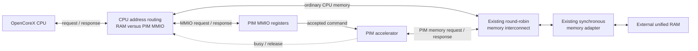
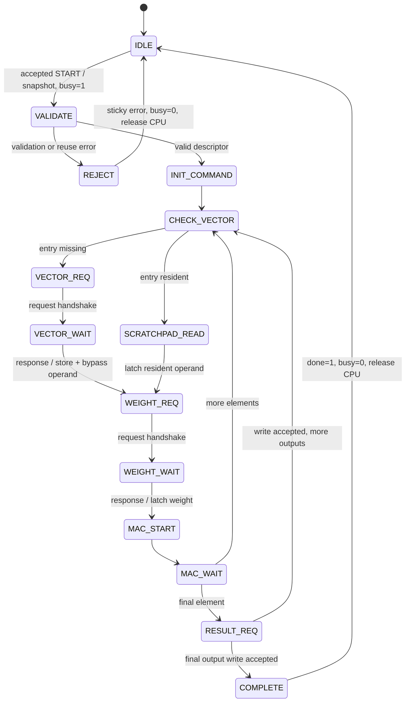

# OpenCoreX PIM Architecture v0.1

## Status

This document records the selected version-1 PIM architecture as of September
24, 2026. Its original implementation plan is retained as a dated design
decision. The 32-bit functional RTL is now implemented in
[`rtl/pim/`](../../rtl/pim/) and integrated by
[`opencorex_pim_subsystem.sv`](../../rtl/system/opencorex_pim_subsystem.sv).
The implemented tests are under [`tb/pim/`](../../tb/pim/),
[`tb/system/`](../../tb/system/), and
[`tb/benchmarks/`](../../tb/benchmarks/). Proposed packed 8-bit D8 and
CIM variants remain separate research work.

The detailed evaluation plan remains deferred until the next advisor meeting.
NeuroSim exploration begins with SRAM and then extends to RRAM if feasible.
PiMulator remains under investigation for compatible system and memory-model
reuse. OpenCoreX measurements must not double-count movement already included
inside either modeling tool.

The streamed digital-MAC organization defined by this document remains the
functional baseline. A matrix-resident SRAM-CIM organization, followed by an
RRAM-CIM counterpart, is a separately named architectural variant. NeuroSim
may characterize the private local storage and the CIM array, but those are
distinct physical structures with separate event and cost accounting.

## Goals and Non-Goals

Version 1 is designed to:

- reduce repeated off-chip or shared-memory vector reads,
- expose buffer occupancy and completion status,
- make traffic and scheduling explicit and measurable,
- tolerate variable request stalls and read-response latency,
- preserve the verified Phase 1 round-robin shared-memory transport,
- execute the existing `1 x 16` by `16 x 32` matrix-vector workload, and
- provide clean extension points for later lanes, queues, interrupts, tiling,
  caches, faults, and pipeline integration.

Version 1 does not implement:

- a PIM-specific ISA extension,
- concurrent CPU/PIM execution after launch,
- multiple outstanding PIM reads or commands,
- multiple MAC lanes,
- vectors larger than the local buffer,
- interrupts or nonblocking execution,
- transactional rollback,
- caches or coherence, or
- architectural CPU access faults.

## System Integration



The verified `opencorex_memory_subsystem` remains unchanged as the Phase 1
transport baseline. A new PIM integration top composes the CPU, address-routing
boundary, PIM accelerator, existing interconnect, and memory adapter.

CPU address routing is implemented as a separate `cpu_address_router` module
because PIM MMIO accesses must be consumed by the PIM register block and must
never reach physical RAM. The router performs an explicit three-way decode:

- implemented RAM-window addresses route to the existing memory interconnect,
- `0x4000_0000` through `0x4000_0FFF` route to the PIM MMIO slave, and
- all other addresses are invalid and never alias RAM or a live register.

The router is a one-master-to-many-slaves decoder, not a replacement for the
existing many-requesters-to-one-memory arbiter. For an accepted CPU read, it
records one response-source bit identifying RAM or PIM MMIO. Writes do not
change this bit because they produce no response.

PIM MMIO reads handshake on the request channel and return a registered
response one cycle later, matching the CPU's existing request/capture states.
MMIO writes complete at their request handshake and produce no response. A
semantically illegal write is still accepted at the transport level and then
reports the appropriate PIM error; it never stalls the CPU indefinitely.

CPU blocking begins only after the `START` write handshakes. The start write
therefore completes normally, while the registered busy state prevents the
next CPU request from receiving ready until PIM completion or rejection.

## Parameters and Arithmetic

| Parameter | Version-1 value or rule |
|---|---|
| `BUFFER_WORDS` | Power of two, default 16; value 1 is legal |
| `MAX_OUTPUTS` | Default 32; value 1 is legal |
| `MAC_LANES` | Exposed architecturally but constrained to 1 |
| Operand width | Signed 32 bits |
| Product | Low 32 bits of signed multiplication |
| Accumulation | Modulo `2^32` |
| Descriptor fields | 32 bits |
| Validation arithmetic | At least 64 bits |

Index widths use guarded expressions so legal one-entry configurations do not
produce zero-width signals:

```systemverilog
localparam int VECTOR_INDEX_W = (BUFFER_WORDS <= 1) ? 1 : $clog2(BUFFER_WORDS);
localparam int OUTPUT_INDEX_W = (MAX_OUTPUTS <= 1) ? 1 : $clog2(MAX_OUTPUTS);
localparam int VALID_COUNT_W = $clog2(BUFFER_WORDS + 1);
```

## Provisional Memory Map

| Address range | Use |
|---|---|
| `0x0000_0000`–`0x01FF_FFFF` | Reserved unified-RAM window; only the implemented parameterized capacity responds |
| `0x0200_0000`–`0x0200_FFFF` | Future timer/software-interrupt block |
| `0x0C00_0000`–`0x0FFF_FFFF` | Future external interrupt controller |
| `0x1000_0000`–`0x1000_0FFF` | Future UART |
| `0x1000_1000`–`0x1000_1FFF` | Future GPIO |
| `0x1000_2000`–`0x1000_2FFF` | Future general-purpose timer |
| `0x2000_0000`–`0x200F_FFFF` | Future ROM expansion |
| `0x4000_0000`–`0x4000_0FFF` | PIM MMIO page |
| `0x4000_1000`–`0x4000_FFFF` | Future accelerator expansion |
| `0xF000_0000`–`0xF000_FFFF` | Future debug, trace, and test control |

The bare-metal reset and program start address remains `0x0000_0000`.

## PIM MMIO Registers

| Offset | Register | Access and behavior |
|---:|---|---|
| `0x00` | `VECTOR_BASE` | Read/write while idle |
| `0x04` | `VECTOR_LENGTH` | Read/write while idle |
| `0x08` | `MATRIX_BASE` | Read/write while idle |
| `0x0C` | `MATRIX_COLUMN_STRIDE` | Read/write while idle |
| `0x10` | `OUTPUT_BASE` | Read/write while idle |
| `0x14` | `OUTPUT_COUNT` | Read/write while idle |
| `0x18` | `COMMAND` | Write-only command action |
| `0x1C` | `STATUS` | Read-only status |
| `0x20` | `VALID_COUNT` | Read-only resident-vector count |
| `0x24` | `ERROR_CODE` | Read-only sticky first-fault code |
| `0x28` | `STATUS_CLEAR` | W1C while idle: bit 1 clears `DONE`; bit 2 clears `ERROR` and `ERROR_CODE` |
| `0x2C` | `RESIDENT_VECTOR_BASE` | Read-only reuse/debug metadata |
| `0x30` | `RESIDENT_VECTOR_LENGTH` | Read-only reuse/debug metadata |
| `0x34` | `CAPABILITIES` | Read-only version and feature flags |
| `0x38` | `BUFFER_WORDS` | Read-only synthesized buffer capacity |
| `0x3C` | `MAX_OUTPUTS` | Read-only synthesized output limit |
| `0x40` | `MAC_LANES` | Read-only synthesized lane count |
| `0x44` | `INTERRUPT_ENABLE` | Reserved; reads zero and rejects writes |
| `0x48` | `INTERRUPT_STATUS` | Reserved; reads zero and rejects writes |
| `0x4C` | `BUFFER_CONTROL` | Write-only while idle; bit 0 invalidates resident vector |
| `0x50`–`0xFFF` | Reserved expansion | Invalid in version 1 |

All MMIO accesses are aligned 32-bit words. Configuration, status-clear, and
buffer-control writes attempted while busy are rejected without changing the
active command. Invalid or unmapped PIM accesses are simulation-fatal until a
future CPU access-fault response exists; they never alias another register.

### Command

| Bit | Meaning |
|---:|---|
| 0 | `START` |
| 1 | `REUSE_VECTOR` |
| 2 | Reserved future `NONBLOCKING`; must be zero |
| 31:3 | Reserved; must be zero |

A write with `START=0` has no launch or modifier effect when unsupported and
reserved bits are zero. Unsupported or reserved bits still report an error.
Modifiers are sampled only with an accepted `START`.

### Status

| Bit | Meaning |
|---:|---|
| 0 | `BUSY` |
| 1 | Sticky `DONE` |
| 2 | Sticky `ERROR` |
| 3 | `VECTOR_FULL` |
| 4 | Reserved future `INTERRUPT_PENDING` |
| 31:5 | Reserved |

`done` clears on reset, W1C, or the next accepted command. `error` and
`error_code` clear only on reset or W1C. A new command is rejected while an
earlier error remains uncleared.

### Capabilities

| Bits | Meaning |
|---:|---|
| 7:0 | Interface version, initially 1 |
| 8 | Vector reuse supported, initially 1 |
| 9 | Nonblocking execution supported, initially 0 |
| 10 | Interrupts supported, initially 0 |
| 11 | Multiple outstanding reads supported, initially 0 |
| 31:12 | Reserved zero |

### Error codes

`ERROR_CODE[7:0]` contains the code and bits 31:8 read zero.

| Value | Meaning |
|---:|---|
| 0 | None |
| 1 | Start while busy |
| 2 | Reserved `PREVIOUS_ERROR_NOT_CLEARED`; not emitted in version 1 because the original first fault is preserved |
| 3 | Reserved command bit set |
| 4 | Unsupported mode |
| 5 | Invalid vector length |
| 6 | Invalid output count |
| 7 | Misaligned address |
| 8 | Invalid column stride |
| 9 | Address arithmetic overflow |
| 10 | Address outside implemented RAM |
| 11 | Input/output overlap |
| 12 | Vector-reuse mismatch |
| 13 | Configuration/control write while busy |
| 14 | Reserved future memory fault |
| 15 | Reserved future memory timeout |
| 16 | Internal protocol error |

## Command Lifecycle and CPU Behavior

On the accepted `START` store handshake, the accelerator atomically:

1. snapshots the programmed descriptor,
2. clears prior `done`,
3. sets `busy`, and
4. activates CPU blocking.

The start store itself completes. The CPU then advances to its following fetch,
which waits because the integration boundary withholds CPU request readiness.
This uses the existing core handshake instead of adding a PIM state to the CPU
controller.

The CPU remains blocked through validation, vector fill, computation, and
result writes. It is released when validation rejects the command or after the
final result-write handshake. Software then reads status before consuming the
output region.

Version 1 has no abort command. Reset is the only forced termination.

## Vector Buffer

The private PIM vector buffer:

- has `BUFFER_WORDS` 32-bit entries,
- uses one synchronous port for either one read or one write per cycle,
- maintains one valid bit per entry,
- exposes `valid_count` and `vector_full`,
- retains physical data bits across commands and reset,
- makes invalid data architecturally unobservable, and
- supports explicit idle-only invalidation.

`valid_count` ranges from zero through `resident_vector_length`.
`vector_full` means every entry in the resident vector is valid; it does not
mean all `BUFFER_WORDS` physical entries are occupied.

For a non-reuse command, validation completes before the controller records the
new resident base/length and clears valid metadata. For reuse, the requested
base and length must match the resident metadata and `vector_full` must be one.
Software owns freshness when it reuses a vector whose shared-memory contents
may have changed.

A memory-request handshake does not make a vector entry valid. On the edge that
accepts its read response, the buffer stores the word, sets its valid bit,
increments `valid_count` if necessary, and updates `vector_full` using the
post-write count.

A missing vector response is also latched directly as the current compute
operand. This response bypass avoids rereading the just-written entry and
prevents dependence on memory-macro read-during-write behavior. Resident
operands use a normal one-cycle synchronous buffer read.

## Validation

Validation is sequential and produces no PIM shared-memory traffic or buffer
mutation. Its deterministic priority is:

1. start while busy,
2. previous sticky error,
3. reserved command bits,
4. unsupported mode,
5. vector length,
6. output count,
7. address alignment,
8. matrix column stride,
9. 64-bit address arithmetic overflow,
10. physical RAM bounds,
11. output overlap with vector or active matrix span, and
12. reuse match.

The active half-open ranges are:

```text
vector  = [vector_base, vector_base + 4 * vector_length)
matrix  = [matrix_base,
           matrix_base + (output_count - 1) * matrix_column_stride
                       + 4 * vector_length)
output  = [output_base, output_base + 4 * output_count)
```

The matrix span conservatively includes stride padding. Vector and matrix may
overlap because both are read-only. Output may overlap neither input range.
Vector, matrix, output, and stride values must be word aligned; stride must be
at least `4 * vector_length`.

A rejected command performs no memory request, output write, or buffer-valid
mutation. It clears `busy`, records the first fault, and releases the CPU.

## Controller and Datapath



Only the PIM controller drives the shared-memory requester. Request address,
type, and write data remain stable until `valid && ready`. After an accepted
read, the controller issues no second read until `rsp_valid` arrives. The MAC
uses a `start`, operands, `busy`, `done`, and result boundary; the controller
does not depend on one-cycle MAC timing.

## Reset and Fault Boundary

All new modules use the repository's asynchronous, active-high reset convention
(`posedge reset`).

Reset clears PIM configuration, status, error information, counters, active
state, valid metadata, and resident metadata. It need not clear scratchpad data
bits or external RAM.

If reset interrupts an operation, RAM writes accepted before reset remain.
The aborted command issues no later requests, and any delayed pre-reset response
is ignored. There is no transactional rollback.

Predictable descriptor failures are PIM device errors. Unexpected memory
failures remain simulation-fatal until the memory response channel and CPU gain
fault status. Error values for future memory fault and timeout reporting are
already reserved.

## Module Boundaries (implemented)

| Module | Responsibility |
|---|---|
| `opencorex_memory_subsystem` | Preserved verified Phase 1 baseline |
| `opencorex_pim_subsystem` | Compose CPU, address routing, PIM accelerator, interconnect, and adapter |
| `cpu_address_router` | Decode RAM, PIM MMIO, and invalid CPU addresses; route ready and read responses; enforce blocking after launch |
| `pim_accelerator` | MMIO-slave and memory-requester integration boundary |
| `pim_mmio_regs` | Programming registers, register decode, and accepted-command pulse |
| `pim_command_validator` | Sequential side-effect-free descriptor validation |
| `pim_controller` | Operation FSM and sole PIM shared-memory requester |
| `pim_vector_buffer` | Synchronous storage, validity, resident metadata, and invalidation |
| `pim_mac` | One-lane CPU-compatible arithmetic behind start/done timing |

The controller snapshots MMIO configuration into active-command registers on
an accepted start. MMIO configuration is not a live input to an active command.

## Original Implementation Order (completed)

The original sequence below was completed with module and integration tests:

1. `pim_pkg` architectural definitions and build ordering
2. `cpu_address_router`
3. `pim_mmio_regs`
4. `pim_command_validator`
5. `pim_vector_buffer`
6. `pim_mac`
7. `pim_controller`
8. `pim_accelerator`
9. the new full PIM subsystem integration top

External module boundaries follow the repository's existing explicit `logic`
port style rather than introducing SystemVerilog interfaces. A small
`pim_pkg.sv` provides only shared architectural definitions: the packed command
descriptor, error-code type, MMIO offsets, and command/status bit positions.
FSM states, parameter-derived widths, counters, and private controls remain
local to their owning modules. Build commands compile `pim_pkg.sv` explicitly
before any module that imports it rather than relying on wildcard order.

## Verification Contract

Verification proceeds from unit modules to controller and full-system tests.
The original verification plan called for:

- a golden arithmetic model matching CPU wraparound semantics,
- randomized request stalls and ordered response delays from 1–20 cycles,
- one directed test per emitted error code,
- multi-defect descriptors that verify first-fault priority,
- power-of-two parameter sweeps including one-entry corner cases,
- reset injection in validation, request, wait, MAC, and write states,
- protocol assertions for stable stalled requests, exactly-once launch,
  one outstanding read, no scratchpad collision, and final-write completion,
- reuse, mismatch, invalidation, partial-fill, and freshness-responsibility
  tests, and
- end-to-end comparison against the existing CPU/software matrix-vector
  reference.

Performance counters remain 64-bit testbench instrumentation until the advisor
confirms the evaluation plan and useful software-visible events.

## Deferred Extensions

- ordered destination FIFO for multiple outstanding reads,
- multiple MAC lanes and a matching weight-supply organization,
- chunking and tiling for vectors larger than the local buffer,
- nonblocking CPU/PIM execution and interrupts,
- architectural memory and MMIO access faults,
- pipelined CPU ordering, hazards, and speculative-execution controls,
- noncoherent cache maintenance followed by possible hardware coherence,
- software-visible performance counters,
- final NeuroSim/PiMulator responsibility and evaluation boundaries,
- a matrix-resident SRAM-CIM architectural variant, and
- an RRAM-CIM counterpart using an explicitly controlled comparison.
