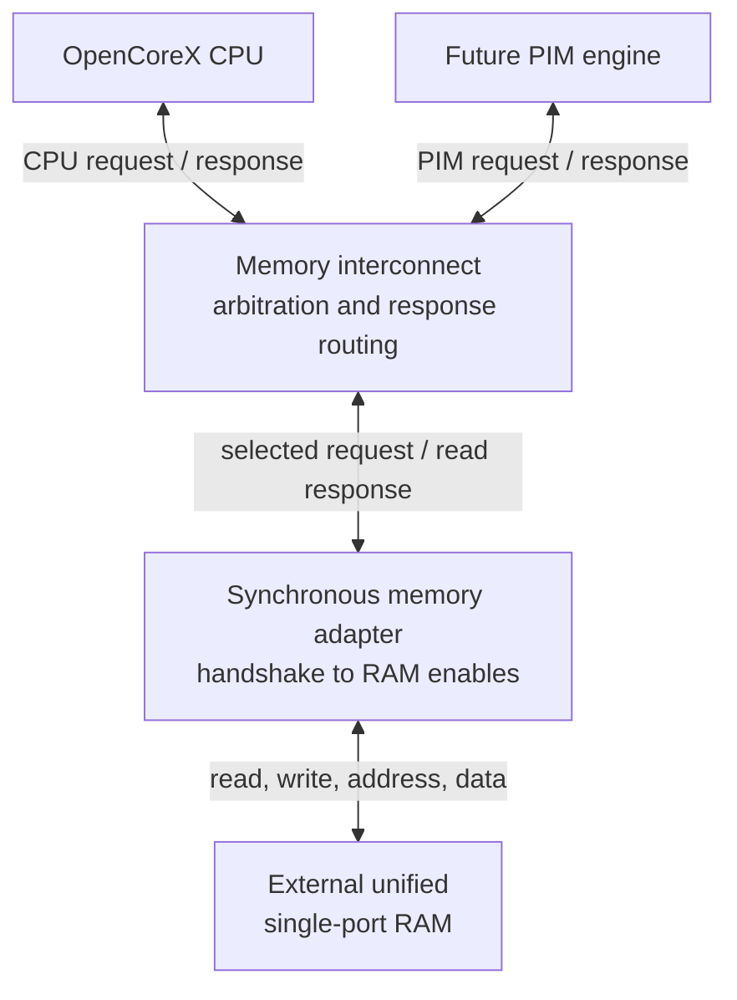

# OpenCoreX Phase 1 Shared-Memory Interface

## Status

This document defines the verified Phase 1 memory interface between the
OpenCoreX CPU, a future PIM requester, and the existing unified single-port
memory.

Phase 1 establishes the communication and arbitration substrate. It does not
yet implement the PIM compute engine, PIM MMIO registers, or completion
synchronization.

The design currently assumes:

- one CPU requester and one PIM requester,
- one physical single-port memory transaction per clock edge,
- fixed one-cycle, in-order read responses,
- no response backpressure,
- no more than one read response returning in a cycle,
- shared access to the complete RAM address space,
- software-managed ownership of data regions,
- RAM contents are preserved across system reset.

## System Topology



The RAM remains outside `opencorex_core` and
`opencorex_memory_subsystem`. This preserves the ability to replace the
simulation memory with FPGA block RAM or another memory implementation.

## Request Channel

Each requester presents the following signals:

| Signal | Direction | Meaning |
|---|---|---|
| `req_valid` | Requester to interconnect | A request and its payload are available. |
| `req_ready` | Interconnect to requester | The selected request can be accepted on this edge. |
| `req_write` | Requester to interconnect | `0` selects a read; `1` selects a write. |
| `req_addr[31:0]` | Requester to interconnect | Byte address of the access. |
| `req_wdata[31:0]` | Requester to interconnect | Data for a write; ignored functionally for a read. |

A request is accepted only when both handshake signals are high on the same
rising clock edge:

```systemverilog
request_fire = req_valid && req_ready;
```

`valid` means "I am presenting a request." `ready` means "that request will
be accepted at this edge." Neither signal alone means that a transaction has
occurred.

While `req_valid` is high and `req_ready` is low, the requester must keep the
operation, address, and write data stable. It may not advance its internal
state as though the request completed.

Only the selected requester receives `req_ready`. The losing requester sees
`req_ready = 0`, even when downstream memory is ready.

## Response Channel

Each requester receives:

| Signal | Direction | Meaning |
|---|---|---|
| `rsp_valid` | Interconnect to requester | Read data is valid during the current cycle. |
| `rsp_rdata[31:0]` | Interconnect to requester | Data returned for the requester's accepted read. |

Writes do not produce responses. An accepted read is therefore:

```systemverilog
accepted_read = request_fire && !mem_req_write;
```

The current response channel has no `rsp_ready` input. A requester must accept
the response whenever `rsp_valid` is asserted. The CPU satisfies this rule by
remaining in a capture state until its response arrives.

## Arbitration Policy

The interconnect implements two-requester round-robin arbitration.

### Uncontended request

If only one requester is valid, that requester is selected.

### Contended request

If both requesters are valid, the requester that did not win the most recently
accepted transaction is selected.

`last_grant` changes only when `request_fire` is true. Merely selecting a
requester does not change round-robin history because no transaction has yet
passed into memory.

On reset, `last_grant` is initialized to `OWNER_PIM`. Therefore, the CPU wins
the first post-reset conflict. This value establishes deterministic initial
priority; it does not represent a PIM transaction having occurred.

### Grant locking under backpressure

If a requester is selected while downstream `mem_req_ready` is low, the
interconnect locks that requester as `locked_owner`.

The lock is required because changing the selected requester during a stall
would change the address or write data visible to memory before the original
request is accepted. While locked:

- `mem_req_valid` remains asserted,
- the selected payload remains unchanged,
- the selected requester sees downstream backpressure,
- the other requester cannot bypass it,
- the lock clears only after `request_fire` or reset.

## Read-Response Ownership

When a read request fires, the interconnect records the accepted requester in
`response_owner`. When the adapter later asserts `mem_rsp_valid`, the
interconnect sends that response only to the recorded owner.

A write does not change `response_owner`, because a write produces no read
response.

One ownership register is sufficient under the current fixed one-cycle,
in-order response contract. Back-to-back reads are legal: each response is
routed using the owner captured for that response pipeline position.

This mechanism is not sufficient for arbitrary variable-latency memory or
multiple outstanding reads. Either extension would require at least one of:

- preventing a new read while another read is pending,
- an owner FIFO aligned with the response stream,
- transaction identifiers or tags,
- explicit response backpressure.

## Synchronous Memory Adapter

The adapter translates the handshake channel into the existing RAM controls.

- `req_ready = 1` whenever the adapter is not in reset.
- A physical read enable is generated only for an accepted read.
- A physical write enable is generated only for an accepted write.
- An accepted read produces `rsp_valid` and the corresponding RAM data in the
  following cycle.
- An accepted write updates RAM at the acceptance edge and produces no
  response.
- Back-to-back accepted reads may keep `rsp_valid` high across consecutive
  cycles; each cycle still represents a distinct response.

The adapter must never assert the RAM read and write enables simultaneously.
The single request's `req_write` field makes each accepted transaction either
a read or a write.

## CPU Controller Behavior

The CPU is blocking with respect to its own fetches and loads. Arbitration is
requester-local: a PIM access may stall the CPU, but the design does not use a
global freeze signal for both requesters.

| CPU state | Request behavior | State advancement |
|---|---|---|
| `FETCH` | Assert a CPU read request using `PC`. | Advance only when `cpu_req_ready` accepts the request. |
| `FETCH_CAPTURE` | Do not issue another request. | Wait for `cpu_rsp_valid`; then assert `IRWrite`. |
| `MEM_READ` | Assert a CPU read request using `ALUOut`. | Advance only when `cpu_req_ready` accepts the request. |
| `MEM_READ_CAPTURE` | Do not issue another request. | Wait for `cpu_rsp_valid`; then assert `MDRWrite`. |
| `MEM_WRITE` | Assert a CPU write request using `ALUOut` and `B`. | Retire the store when `cpu_req_ready` accepts it; do not wait for a response. |

When `FETCH` is stalled, the PC and fetch-related registers must remain stable.
When `MEM_READ` is stalled, the effective address and CPU request payload must
remain stable. `IRWrite` and `MDRWrite` occur in response-capture states rather
than at request acceptance.

## Timing Examples

### Accepted read

| Cycle | Requester | Interconnect/adapter | CPU effect |
|---|---|---|---|
| N, before edge | `req_valid=1`, stable read address | Selected `req_ready=1`; `request_fire=1` | Request state is permitted to advance. |
| N, rising edge | Read is accepted | RAM samples the address; response owner is recorded | CPU enters its capture state. |
| N+1 | Request may be deasserted | `rsp_valid=1`, `rsp_rdata` contains returned word | `IRWrite` or `MDRWrite` captures the word at the edge. |

### Stalled request

| Condition | Required behavior |
|---|---|
| `req_valid=1`, `req_ready=0` | No transaction fires. |
| Downstream memory is not ready | Selected request and payload stay visible. |
| Both requesters remain valid | Locked owner remains selected. |
| Memory becomes ready | Only the locked owner receives ready and advances. |

### Accepted write

| Cycle | Behavior |
|---|---|
| N, before edge | Selected requester presents `req_valid=1`, `req_write=1`, address, and data. |
| N, rising edge | `request_fire=1`; RAM commits the write. |
| N+1 | No read response is generated; requester may continue after acceptance. |

## Reset Contract

Reset affects protocol and CPU state but does not clear RAM contents.

During reset:

- downstream request valid is blocked,
- CPU and PIM request ready outputs are low,
- the grant lock is cleared,
- round-robin state is initialized deterministically,
- stale read-response validity is cleared,
- the CPU controller returns to its reset state,
- no pending PIM request is preserved by the interconnect,
- external RAM contents remain unchanged.

After reset is released, requesters must reassert any operation that still
needs to be performed. A future PIM engine must define separately whether its
command/status registers are cleared or whether software must restart an
aborted command.

## Memory Ownership and Ordering

The arbiter provides physical-port ownership for one transaction at a time.
It does not provide semantic ownership of memory regions.

Currently:

- CPU and PIM addresses are drawn from the same address space,
- either requester can address any implemented RAM word,
- arbitration prevents two accesses from being accepted on the same edge,
- accepted transactions are ordered by the sequence of `request_fire` events,
- there are no caches and therefore no cache-coherence protocol,
- there is no access protection or region enforcement,
- software must not allow the CPU to consume a destination before PIM has
  completed writing it.

The later PIM command protocol must define when input, weight, and output
regions change ownership and how the CPU observes completion.

## Verified Phase 1 Results

| Result | Verified value |
|---|---:|
| Positive regression testbenches | 20 |
| Expected-failure memory tests | 3 |
| Matrix-vector outputs checked | 32 / 32 |
| Direct-core matrix-vector active cycles | 23,685 |
| Subsystem matrix-vector active cycles with idle PIM | 23,685 |
| Instruction fetches through completion | 4,327 |
| Scalar multiplications | 512 |
| Scalar accumulating additions | 512 |
| CPU smoke-test contention cost | 1 additional cycle |

The identical direct-core and idle-PIM subsystem cycle counts show that the
adapter and interconnect add no cycles when there is no contention and memory
is continuously ready. The contention test demonstrates that a PIM write can
win one arbitration slot, hold the CPU fetch stable for that slot, commit its
data, and then allow the CPU to resume correctly.

## Verified Invariants

The Phase 1 tests cover the following architectural properties:

- reset blocks request acceptance,
- only the selected requester receives ready,
- downstream backpressure prevents requester advancement,
- a stalled grant and its payload remain stable,
- round-robin priority changes only after an accepted transaction,
- writes do not generate responses or alter read-response ownership,
- read responses return to the requester that issued the read,
- back-to-back request and response activity is supported under fixed latency,
- CPU fetch and load state advance only at the correct handshake events,
- CPU and PIM writes both reach the external shared RAM,
- reset restarts the CPU and protocol state without erasing RAM,
- the CPU-only matrix-vector baseline is preserved through the subsystem.

## What Phase 1 Does Not Yet Provide

- A PIM compute datapath or execution FSM
- PIM command encoding or custom instruction decoding
- Command, status, source, weight, destination, or configuration registers
- `start`, `busy`, `done`, or `error` semantics
- Polling, interrupt, or wait-instruction synchronization
- A descriptor format
- Protection between CPU-owned and PIM-owned memory regions
- Variable-latency memory support
- Multiple outstanding reads or commands
- Request or response queues
- DMA
- Caches or coherence
- Fairness bounds beyond two-requester round robin
- Bandwidth reservation or quality-of-service policy
- Formal verification properties
- Synthesized area, timing, or FPGA resource measurements

## Selected Phase 2 Architecture

Phase 2 architecture decisions were completed through September 24, 2026.
The full contract is maintained in
[`pim-architecture-v0.1.md`](pim-architecture-v0.1.md). The decisions that
directly extend this Phase 1 transport are:

- Version 1 uses an MMIO register page at `0x4000_0000`; no PIM-specific ISA
  extension is required.
- The CPU's accepted `START` store completes, after which later CPU requests
  are blocked through the existing request/ready mechanism until PIM finishes
  or rejects the command.
- A private, power-of-two vector buffer defaults to 16 words and exposes
  `valid_count` and `vector_full` status.
- The buffer has one synchronous read-or-write port. A returning vector word
  is written locally and bypassed directly to the current compute operand.
- The controller issues at most one PIM read at a time and waits for
  `pim_rsp_valid`; it does not assume the current adapter's one-cycle timing.
- Version 1 retains round-robin arbitration and one physical shared-memory
  port. Because the CPU is blocked after launch, ordinary PIM execution has no
  CPU traffic competing for that port.
- Writes complete at their request handshake. `done` is asserted only after
  the final output write is accepted.
- Results use the configured output region. Predictable alignment, bounds,
  overflow, stride, overlap, and reuse failures are rejected before PIM data
  traffic begins.
- Reset clears PIM control and buffer-valid state but does not roll back RAM
  writes that were already accepted.

### Required integration change

The current `opencorex_memory_subsystem` connects every CPU request directly
to the RAM interconnect. MMIO therefore requires an address-routing boundary
before that interconnect:

- ordinary CPU addresses continue to the interconnect and RAM,
- addresses in the PIM page go to the PIM MMIO slave,
- MMIO requests never reach the physical RAM adapter,
- the PIM engine remains a requester on the existing PIM interconnect port.

The verified Phase 1 subsystem remains as the transport baseline. A new PIM
integration top will compose the core, address-routing boundary, accelerator,
existing interconnect, and memory adapter.

### Variable-latency boundary

The PIM controller will tolerate arbitrary response delay with one
outstanding read. The current shared interconnect and synchronous adapter
remain fixed-latency Phase 1 components until the system-level memory contract
is deliberately extended. Supporting arbitrary latency throughout the whole
system will require preventing a second read while a response is pending or
adding ordered ownership storage.

## Remaining Research Questions

1. Which internal timing, energy, area, and data movement should come from
   NeuroSim, and which memory-system behavior should come from PiMulator?
2. Which external traffic and scheduling policies constitute the OpenCoreX
   contribution without duplicating movement counted by either tool?
3. After the SRAM study, which RRAM organization and assumptions provide a
   fair comparison?
4. Which counters and evaluation metrics should become software-visible after
   the advisor confirms the evaluation plan?

## Sources and Research Context

- OpenCoreX repository files: `rtl/memory_interconnect.sv`,
  `rtl/synchronous_memory_adapter.sv`, `rtl/opencorex_memory_subsystem.sv`,
  `rtl/opencorex_core.sv`, and `rtl/controller.sv`.
- OpenCoreX verification files: `tb/memory_interconnect_tb.sv`,
  `tb/synchronous_memory_adapter_tb.sv`, `tb/memory_subsystem_tb.sv`,
  `tb/opencorex_memory_subsystem_tb.sv`, and
  `tb/opencorex_matvec_subsystem_tb.sv`.
- RISC-V International, [Unprivileged ISA Specification](https://docs.riscv.org/reference/isa/unpriv/unpriv-index.html), for standard instruction formats and the rules surrounding ISA extensions.
- Arm, [AMBA AXI and ACE Protocol Specification](https://developer.arm.com/documentation/ihi0022/latest/), as a reference for ready/valid channel reasoning. OpenCoreX does not claim AXI compliance.
- Mosanu et al., [PiMulator: A Fast and Flexible Processing-in-Memory Emulation Platform](https://ieeexplore.ieee.org/document/9774614), for FPGA-oriented PIM system and memory modeling.
- NeuroSim project, [central repository](https://github.com/neurosim/NeuroSim), for compute-in-memory array-level modeling.
- Lu et al., [NeuroSim Simulator for Compute-in-Memory Hardware Accelerator](https://www.frontiersin.org/journals/artificial-intelligence/articles/10.3389/frai.2021.659060/full), for the scope and validation of NeuroSim across device, circuit, and algorithm levels.
- Chen and Yang, [Optimizing and Exploring System Performance in Compact PIM-based Chips](https://arxiv.org/abs/2502.21259), for the research direction motivating system-level compact-PIM evaluation.
