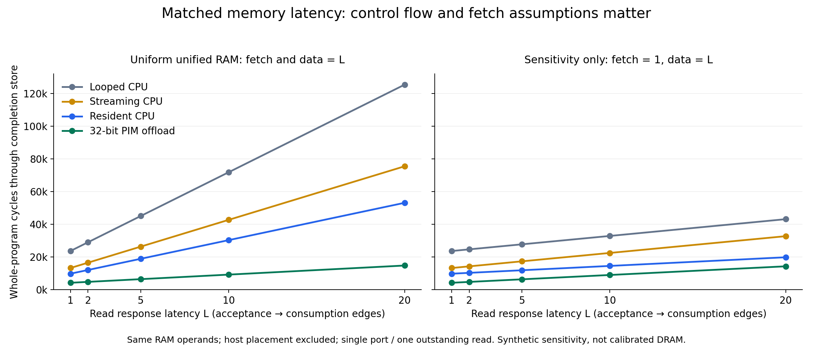
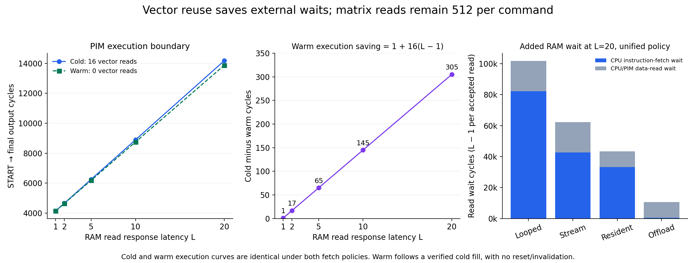

# Matched memory-response sensitivity — meeting with Professor Stan

The primary **uniform unified-memory** policy increases latency for every RAM
read, including CPU instruction fetches. A separately labeled **fixed-fetch**
sensitivity case keeps instruction reads at one cycle and delays RAM data reads
identically for CPU and PIM. MMIO retains the existing one-cycle status interface
in both cases. Both use acceptance-to-response-consumption edges, immediate
accepted writes, a single RAM port and one outstanding read.
See the [policy committed before coding](../memory-response-policy.md) and
[comparison contract](../comparison-contract.md).

All 50 program configurations passed: 30 CPU runs, 10 one-command PIM offloads,
and 10 two-command PIM programs, checking 1,920 output stores in total.
The 30 PIM commands include 10 successful warm commands with verified buffer
contents from their immediately preceding cold fill, without reset/invalidation.
Every run checks unchanged operands, completion, fixed traffic counts,
one-cycle measurements, response deadlines/data/ownership, and stalled-request
stability. A separate responder test forces pending-write backpressure and checks
write acceptance, fixed-fetch timing and reset cancellation. Production RTL is
unchanged; the runner mechanically replaces only the production top's RAM
adapter in ignored build output, with exact-match assertions against topology
drift. The one-cycle setting reproduces every existing program measurement.

## Whole-program cycles: primary unified-memory policy

| L | Looped CPU | Streaming CPU | Resident CPU | PIM offload | Two-command PIM total |
|---|---|---|---|---|---|
| 1 | 23,685 | 13,290 | 9,818 | 4,272 | 8,452 |
| 2 | 29,037 | 16,563 | 12,099 | 4,827 | 9,525 |
| 5 | 45,093 | 26,382 | 18,942 | 6,492 | 12,744 |
| 10 | 71,853 | 42,747 | 30,347 | 9,267 | 18,109 |
| 20 | 125,373 | 75,477 | 53,157 | 14,817 | 28,839 |

Whole-program boundaries include CPU setup and status handling, ending at the
accepted RKYC store. The last column executes two workloads; use its explicitly
cold-inclusive average or command boundaries, not as a single offload.

## Separately labeled sensitivity: instruction fetch fixed at one cycle

This assumes different latency classes for instruction and data reads on the
same single port; it is not the uniform primary policy and does not model a
cache. Data-read delays, write timing, ordering and outstanding limits are
unchanged.

| L | Looped CPU | Streaming CPU | Resident CPU | PIM offload | Two-command PIM total |
|---|---|---|---|---|---|
| 1 | 23,685 | 13,290 | 9,818 | 4,272 | 8,452 |
| 2 | 24,710 | 14,315 | 10,347 | 4,802 | 9,494 |
| 5 | 27,785 | 17,390 | 11,934 | 6,392 | 12,620 |
| 10 | 32,910 | 22,515 | 14,579 | 9,042 | 17,830 |
| 20 | 43,160 | 32,765 | 19,869 | 14,342 | 28,250 |

At L=20, the resident CPU/offload whole-program ratio is 3.588 under unified
latency and 1.385 with fixed fetch latency (2.298 at L=1 for both).
These are observations for different assumptions, not calibrated DRAM speedups.

## Cold versus warm execution: identical under both policies

| L | Cold execution | Warm execution | Saving | Saving / cold | Execution average N=2, includes cold |
|---|---|---|---|---|---|
| 1 | 4141 | 4140 | 1 | 0.024% | 4140.5 |
| 2 | 4669 | 4652 | 17 | 0.364% | 4660.5 |
| 5 | 6253 | 6188 | 65 | 1.040% | 6220.5 |
| 10 | 8893 | 8748 | 145 | 1.630% | 8820.5 |
| 20 | 14173 | 13868 | 305 | 2.152% | 14020.5 |

Each command performs 512 matrix reads, 32 writes and 512 MACs. Cold/warm vector
RAM reads are 16/0; buffer writes 16/0 and buffer reads 496/512.
CPU blocked by PIM busy equals the execution-cycle count in this table.
The existing one-command cold offload has the same execution interval; its
different whole-program setup/status boundary remains in programs.csv.

Observed saving: 1, 17, 65, 145 and 305 cycles. Increasing latency exposes
the 16 avoided vector reads, but even at L=20 the saving is only 2.152%
of cold execution because the 512 matrix reads remain. Measured identities:
cold = 4141 + 528(L−1), warm = 4140 + 512(L−1), saving = 1 + 16(L−1).
These summarize the measured sweep, not measurements at other L.

Controller explanation (inference from RTL): cold vector request/wait/response
bypass and warm buffer read/capture have equal base state time at L=1. Cold
additionally initializes the vector once. External responses extend cold's
vector wait path; local buffer timing does not change. Matrix/MAC scheduling
stays the same. Thus 16 avoided external waits plus initialization explain the
observations; reduced traffic alone does not imply proportional latency savings.

## Setup and completion/status outside execution

Primary unified-memory policy:

| L | Cold setup | Cold status/clear | Warm setup | Warm status/completion | Two-command total / 2 |
|---|---|---|---|---|---|
| 1 | 87 | 38 | 17 | 29 | 4226.0 |
| 2 | 105 | 44 | 20 | 35 | 4762.5 |
| 5 | 159 | 62 | 29 | 53 | 6372.0 |
| 10 | 249 | 92 | 44 | 83 | 9054.5 |
| 20 | 429 | 152 | 74 | 143 | 14419.5 |

Fixed-fetch sensitivity:

| L | Cold setup | Cold status/clear | Warm setup | Warm status/completion | Two-command total / 2 |
|---|---|---|---|---|---|
| 1 | 87 | 38 | 17 | 29 | 4226.0 |
| 2 | 88 | 38 | 17 | 30 | 4747.0 |
| 5 | 91 | 38 | 17 | 33 | 6310.0 |
| 10 | 96 | 38 | 17 | 38 | 8915.0 |
| 20 | 106 | 38 | 17 | 48 | 14125.0 |

Cold setup runs through cold START inclusive; cold status/clear ends at accepted
STATUS_CLEAR. Warm setup runs after that clear through warm START; warm
completion ends at accepted RKYC. These six adjacent intervals sum to the
two-command whole-program total. Do not add blocked/wait counters, which overlap
these intervals. Different setup/status work is not vector-reuse acceleration.

For N execution commands starting cold, average = [Tcold + (N−1)Twarm]/N
= Twarm + [1+16(L−1)]/N. At L=20 the measured two-command execution average
is 14,020.5 cycles, not 13,868. For N=10 this projects 13,898.5 (only N=2 was
executed). Whole-program N=2 averages above include actual control/status work
and initial cold cost; no unmeasured steady-state host/control overhead is
assumed. Matrix reads average 512 per command, vector reads 16/N.

## Executable counters and instruction-fetch contribution

At L=20 under primary unified timing:

| Program | Fetches | Vector reads | Matrix reads | Output writes | CPU blocked | Fetch wait | CPU data wait | PIM data wait | Fetch share of added cycles |
|---|---|---|---|---|---|---|---|---|---|
| looped | 4327 | 512 | 512 | 32 | 0 | 82213 | 19475 | 0 | 80.85% |
| streaming | 2248 | 512 | 512 | 32 | 0 | 42712 | 19475 | 0 | 68.68% |
| resident | 1752 | 16 | 512 | 32 | 0 | 33288 | 10051 | 0 | 76.81% |
| offload | 25 | 16 | 512 | 32 | 14173 | 475 | 38 | 10032 | 4.50% |
| cold_warm | 31 | 16 | 1024 | 64 | 28041 | 589 | 38 | 19760 | 2.89% |

Two-command totals include 64 outputs and 1,024 matrix reads. Other rows
represent one workload. All programs also perform one completion write.
CPU programs have one signature RAM read; PIM programs have a literal plus
signature RAM read. MMIO counts are 7 writes/1 read for offload and
9 writes/6 reads for cold/warm.

Added read waits equal L−1 per accepted read, split into CPU fetch, CPU data and
PIM data. CPU blocked counts pending requests denied acceptance; CPU response
waiting is separate, so zero blocked clocks for CPU-only programs does not mean
zero memory stalls. All blocked request clocks here are caused by PIM busy.
For every measured case, whole-program growth equals the sum of categorized
read waits. Fixed-fetch runs have zero fetch wait and the same data waits.
Full per-configuration counters and command boundaries are in
[programs.csv](programs.csv) and [commands.csv](commands.csv);
cold-inclusive averages and labeled projections are in
[repeated-commands.csv](repeated-commands.csv).

## Reproduce and limits

Run from /home/robel/OpenCoreX in Ubuntu WSL:

~~~bash
make latency-sweep
python3 scripts/run_memory_latency_sweep.py --check
python3 scripts/summarize_memory_latency.py
PYTHONPATH=obj_dir/plot_dependencies python3 scripts/plot_memory_latency.py
make verify
git diff --check
~~~

The full Verilator build command is printed into /tmp/opencorex-latency.log;
build/simulation logs are under obj_dir/verification/memory_latency and
obj_dir/verification/latency_responder_unit. The default runner regenerates
CSV measurements; --check, make test and make verify compare exact snapshots.
Plotting uses Matplotlib 3.10.8 installed only under ignored obj_dir with:

~~~bash
python3 -m pip install --target obj_dir/plot_dependencies matplotlib==3.10.8
~~~

Plotting dependencies are not required for RTL verification.
This is a deterministic sensitivity experiment, not calibrated DRAM.
There are no banks, row hits, refresh, bursts, caches, physical timings or
energy parameters. Host placement is excluded; operands begin in the same RAM.
The CPU has no cache; PIM is a separate digital MAC, not in-array CIM.
Cycles cannot establish area, energy or physical clock-time superiority.
The resident CPU is the strongest implemented 16×32 comparator; the looped
CPU remains the general reference. Results do not extrapolate to larger matrices,
packed int8, matrix residency or nonblocking execution.

Next: define packed signed-int8 layout and CPU extraction, then implement the
one-lane D8 digital comparator and its CPU reference before SRAM CIM or RRAM.
See the [architecture memo](../d8-sram-cim-design-memo.md).
